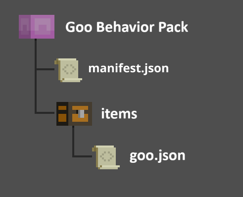
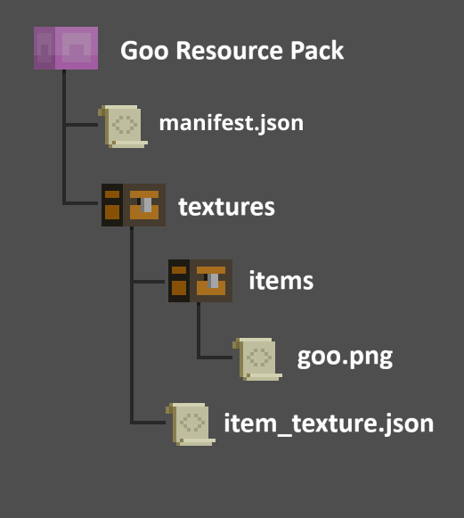
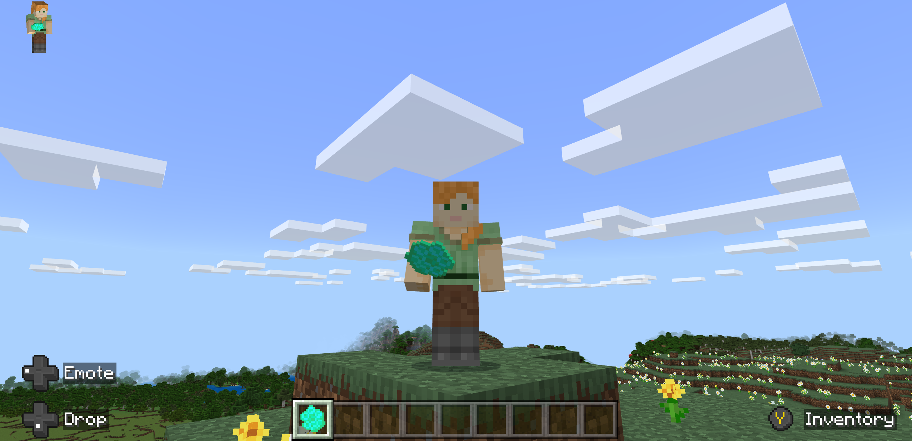
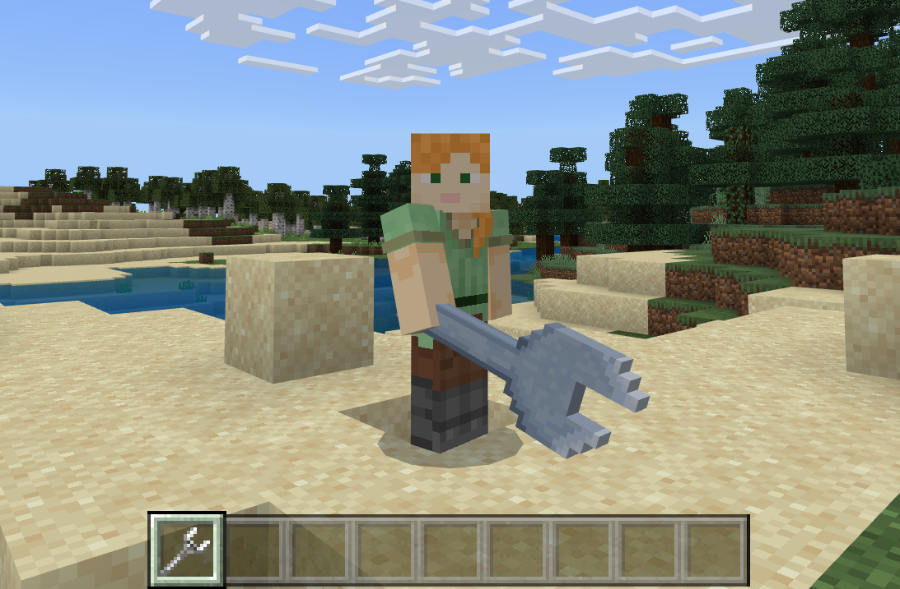
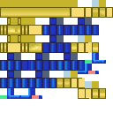

# Custom Items

It's possible to customize or create items in Minecraft, just like you can create custom blocks and entities.

This tutorial shows you how to create the structure and files needed for the add-on packs for different items.
Different types of items require different files, depending on what Minecraft needs to know about the item. For example, things a player wears, like a crown, will require a **model** file, among other things.

It's important to remember that each of these files have to be stored in a folder with the correct name, in the exact location specified.

### Prerequisites

It is recommended that the following be completed before beginning this tutorial:

- [Getting Started with Add-On Development](GettingStarted.md)
- [Introduction to Resource Packs](ResourcePack.md)
- [Introduction to Behavior Packs](BehaviorPack.md)
- [How to Add a Simple Custom Block](AddCustomDieBlock.md)
- [Minecraft Item Wizard](MinecraftItemWizard.md)

Here is a link to the [Vanilla Minecraft Add-on Packs](https://aka.ms/resourcepacktemplate) in case you want to take a look at the pack structure there.

## Minecraft Custom Items

Here are three items that do not currently exist in Vanilla Minecraft. They are listed here in order of complexity:

>- Goo
>- Wrench
>- Crown

Use the following sections to create add-on packs for each item, or to do one set of packs for two or more items.

Here is the general process from the Add-on pack tutorials:

1. Create Behavior Pack and Resource Pack folders.
1. Create the folder and file structure for the item you want to create. Be sure to include the **manifest.json** files.
1. Copy/paste the contents for the custom item files from the content in each section.
1. Download and save the graphic files into the correct location.
1. Load the packs into the **development_behavior_pack** and **development_resource_pack** folders in your com.mojang folder.
1. Launch Minecraft: Bedrock Edition.
1. Create a world with the behavior pack and resource packs activated. 
1. Choose either Creative Mode or Survival Mode with cheats toggled on.
1. Go into your world and use the `/give @s demo:<item>` command to get your custom item.

You can also experiment with different item components and edit the graphic and model files in an application like [Blockbench](https://www.blockbench.net)

Here is the template for each **manifest.json** file, which is also found in the [Resource Pack](ResourcePack.md) and [Behavior Pack](BehaviorPack.md) tutorials.

Be sure to put your own [UUIDs](https://www.uuidgenerator.net/) in there.

**Behavior Pack/manifest.json**

```json
{
  "format_version": 2,
  "header": {
    "description": "Custom Item Behavior Pack",
    "name": "Custom Item Behavior Pack",
    "uuid": "<ADD YOUR OWN UUID>",
    "version": [1, 0, 1],
    "min_engine_version": [1, 20, 30]
  },
  "modules": [
    {
      "description": "Custom Item Behavior Pack",
      "type": "data",
      "uuid": "<ADD YOUR OWN UUID>",
      "version": [1, 0, 1]
    }
  ]
}
```

**Resource Pack/manifest.json**

```json
{
  "format_version": 2,
  "header": {
    "description": "Custom Item Resource Pack",
    "name": "Custom Item Resource Pack",
    "uuid": "<ADD YOUR OWN UUID>",
    "version": [1, 0, 1],
    "min_engine_version": [1, 20, 30]
  },
  "modules": [
    {
      "description": "Custom Item Resource Pack",
      "type": "resources",
      "uuid": "<ADD YOUR OWN UUID>",
      "version": [1, 0, 1]
    }
  ]
}
```

## Goo

Goo is the simplest custom item. You don't wear it or eat it. It's just a handful of weird goo.
It's useful for making sure your add-on packs work and for experimenting with stack size and the display name.

### Goo Behavior Pack
items
  goo.json
manifest.json



**Goo Behavior Pack/items/goo.json**

```json
{
  "format_version": "1.20.30",
  "minecraft:item": {
    "description": {
      "identifier": "demo:goo",
      "category": "Items"
    },
    "components": {
      "minecraft:max_stack_size": 16,
      "minecraft:icon": {
        "texture": "demo:goo"
      },
      "minecraft:display_name": {
        "value": "Weird Goo"
      }
    }
  }
}
```

### Goo Resource Pack

```
textures
  items
    goo.png
  item_texture.json
manifest.json
```



**Goo Resource Pack/textures/item_texture.json**
```json
{
  "resource_pack_name": "Goo Resource Pack",
  "texture_data": {
    "demo:goo": {
      "textures": "textures/items/goo"
    }
  }
}
```

**Goo Resource Pack/textures/items**

Here is a.png file to download and use for the goo texture:


## Custom Goo Result

After you create the packs, go into Minecraft, and give yourself goo, it should look like this:



## Wrench

An awesome giant wrench! This item has separate texture files for the version in your hotbar and the version you hold in your hand.

### Wrench Behavior Pack

```
items
  wrench.json
manifest.json
```

**Wrench Behavior Pack/items/wrench.json**

```json
{
  "format_version": "1.20.30",
  "minecraft:item": {
    "description": {
      "identifier": "demo:wrench",
      "category": "Items"
    },

    "components": {
      "minecraft:max_stack_size": 16,
      "minecraft:icon": {
        "texture": "demo:wrench"
      },
      "minecraft:wearable": {
        "dispensable": true,
        "slot": "slot.weapon.offhand"
      }
    }
  }
}
```

### Wrench Resource Pack

```
attachables
  wrench.player.json
models
  entity
    wrench.geo.json
textures
  items
    wrench.png
    wrench_ico.png
  item_texture.json
manifest.json
```


**Wrench Resource Pack/attachables/wrench.player.json**

```json
{
  "format_version": "1.20.30",
  "minecraft:attachable": {
    "description": {
      "identifier": "demo:wrench",
      "item": { "demo:wrench": "query.is_owner_identifier_any('minecraft:player')" },
      "materials": {
        "default": "entity",
        "enchanted": "entity_alphatest_glint"
      },
      "textures": {
        "default": "textures/items/wrench",
        "enchanted": "textures/misc/enchanted_item_glint"
      },
      "geometry": {
        "default": "geometry.wrench"
      },
      "animations": {
        "hold_first_person": "animation.steve_head.hold_first_person",
        "hold_third_person": "animation.steve_head.hold_third_person"
      },
      "scripts": {
        "animate": [
          {
            "hold_first_person": "context.is_first_person == 1.0"
          },
          {
            "hold_third_person": "context.is_first_person == 0.0"
          }
        ]
      },
      "render_controllers": ["controller.render.item_default"]
    }
  }
}
```

**Wrench Resource Pack/models/entity/wrench.geo.json**

```json
{
  "format_version": "1.16.0",
  "minecraft:geometry": [
    {
      "description": {
        "identifier": "geometry.wrench",
        "texture_width": 32,
        "texture_height": 32,
        "visible_bounds_width": 3,
        "visible_bounds_height": 4,
        "visible_bounds_offset": [0, 1, 0]
      },
      "bones": [
        {
          "name": "bb_main",
          "pivot": [0.1, 19, -6],
          "rotation": [125, 0, 0],
          "binding": "q.item_slot_to_bone_name(context.item_slot)",
          "cubes": [
            {"origin": [-0.9, 9, -8], "size": [2, 16, 3], "uv": [0, 13]},
            {"origin": [-0.9, 25, -11], "size": [2, 4, 9], "uv": [0, 0]},
            {"origin": [-0.9, 29, -5], "size": [2, 2, 3], "uv": [13, 0]},
            {"origin": [-0.9, 29, -11], "size": [2, 1, 3], "uv": [10, 13]},
            {"origin": [-0.9, 30, -10], "size": [2, 1, 2], "uv": [10, 17]},
            {"origin": [-0.9, 31, -5], "size": [2, 1, 3], "uv": [13, 5]},
            {"origin": [-0.9, 32, -5], "size": [2, 1, 2], "uv": [0, 6]},
            {"origin": [-0.9, 31, -9], "size": [2, 1, 1], "uv": [17, 19]},
            {"origin": [-0.9, 33, -5], "size": [2, 1, 1], "uv": [16, 17]},
            {"origin": [-0.9, 24, -5], "size": [2, 1, 2], "uv": [0, 3]},
            {"origin": [-0.9, 24, -10], "size": [2, 1, 2], "uv": [0, 0]},
            {"origin": [-0.9, 23, -5], "size": [2, 1, 1], "uv": [17, 13]},
            {"origin": [-0.9, 23, -9], "size": [2, 1, 1], "uv": [7, 13]}
          ]
        }
      ]
    }
  ]
}
```

**Wrench Resource Pack/textures/items**

Here are the image files to use for the wrench icon and for the wrench itself.

Here is the wrench icon:


Here is the wrench texture:


**Wrench Resource Pack/textures/item_texture.json**

```json
{
  "resource_pack_name": "Wrench Resource Pack",
  "texture_data": {
    "demo:goo": {
      "textures": "textures/items/wrench_ico"
    }
  }
}
```

After you create the packs, go into Minecraft, and give yourself a wrench, it should look like this:



## Crown

This is a crown created by customizing a helmet.

### Crown Behavior Pack

```
items
  crown.json
manifest.json
```


**Crown Behavior Pack/items/crown.json**

```json
{
  "format_version": "1.20.30",
  "minecraft:item": {
    "description": {
      "identifier": "demo:crown",
      "category": "Items"
    },
    "components": {
      "minecraft:max_stack_size": 1,
      "minecraft:icon": {
        "texture": "demo:crown"
      },
      "minecraft:wearable": {
        "dispensable": true,
        "slot": "slot.armor.head"
      }
    }
  }
}
```

### Crown Resource Pack

```
attachables
  crown.player.json
models
  entity
    crown.geo.json
textures
  items
    crown_ico.png
    crown_minecraft.png
  item_texture.json
manifest.json
```


**Crown Resource Pack/attachables/crown.player.json**

```json
{
  "format_version": "1.19.80",
  "minecraft:attachable": {
    "description": {
      "identifier": "demo:crown_hat.player",
      "item": { "demo:crown": "query.is_owner_identifier_any('minecraft:player')" },
      "materials": {
        "default": "armor",
        "enchanted": "armor_enchanted"
      },
      "textures": {
        "default": "textures/items/crown_minecraft",
        "enchanted": "textures/misc/enchanted_item_glint"
      },
      "geometry": {
        "default": "geometry.crown"
      },
      "scripts": {
        "parent_setup": "variable.helmet_layer_visible = 0.0;"
      },
      "render_controllers": ["controller.render.armor"]
    }
  }
}
```

**Crown Resource Pack/models/entity/crown.geo.json**

This file creates the custom shape of the crown that the texture will be mapped on to.

```json
{
  "format_version": "1.16.0",
  "minecraft:geometry": [
    {
      "description": {
        "identifier": "geometry.crown",
        "texture_width": 32,
        "texture_height": 32,
        "visible_bounds_width": 2,
        "visible_bounds_height": 3.5,
        "visible_bounds_offset": [0, 1.25, 0]
      },
      "bones": [
        {
          "name": "Crownbase",
          "pivot": [0, 0, 0],
          "binding": "q.item_slot_to_bone_name(context.item_slot)",
          "cubes": [
            {"origin": [-3, 31, -6.4], "size": [6, 3, 2], "uv": [1, 0]},
            {"origin": [-5, 31, -6.4], "size": [6, 3, 2], "pivot": [-1, 31, -1.4], "rotation": [0, 90, 0], "uv": [0, 0]},
            {"origin": [-3, 31, 1.6], "size": [6, 3, 2], "pivot": [1, 31, -1.4], "rotation": [0, 90, 0], "uv": [0, 0]},
            {"origin": [-3, 31, 4.6], "size": [6, 3, 2], "uv": [1, 0]},
            {"origin": [3, 31, -5.4], "size": [2, 3, 2], "uv": [24, 0]},
            {"origin": [3, 31, 2.6], "size": [2, 3, 2], "uv": [22, 23]},
            {
              "origin": [-5, 31, -5.4],
              "size": [2, 3, 2],
              "uv": {
                "north": {"uv": [18, 22], "uv_size": [2, 3]},
                "east": {"uv": [16, 22], "uv_size": [2, 3]},
                "south": {"uv": [22, 22], "uv_size": [2, 3]},
                "west": {"uv": [20, 22], "uv_size": [2, 3]},
                "up": {"uv": [18, 20], "uv_size": [2, 2]},
                "down": {"uv": [20, 22], "uv_size": [2, -2]}
              }
            },
            {"origin": [-5, 31, 2.6], "size": [2, 3, 2], "uv": [20, 10]}
          ]
        },
        {
          "name": "crownprongs",
          "pivot": [0, 0, 0],
          "binding": "q.item_slot_to_bone_name(context.item_slot)",
          "cubes": [
            {"origin": [-5, 34, -5.4], "size": [2, 3, 2], "uv": [8, 20]},
            {"origin": [3, 34, 2.6], "size": [2, 3, 2], "uv": [20, 5]},
            {"origin": [3, 34, -5.4], "size": [2, 3, 2], "uv": [0, 20]},
            {"origin": [-5, 34, 2.6], "size": [2, 3, 2], "uv": [16, 15]}
          ]
        },
        {
          "name": "crownextraprongs",
          "pivot": [0, 0, 0],
          "binding": "q.item_slot_to_bone_name(context.item_slot)",
          "cubes": [
            {"origin": [-1, 34, -6.4], "size": [2, 3, 2], "uv": [8, 15]},
            {"origin": [-6, 34, -1.4], "size": [2, 3, 2], "uv": [0, 15]},
            {"origin": [-1, 34, 4.6], "size": [2, 3, 2], "uv": [12, 10]},
            {"origin": [4, 34, -1.4], "size": [2, 3, 2], "uv": [12, 5]}
          ]
        },
        {
          "name": "crownjewels",
          "pivot": [0, 0, 0],
          "binding": "q.item_slot_to_bone_name(context.item_slot)",
          "cubes": [
            {"origin": [-7, 32, -1.4], "size": [1, 1, 2], "uv": [6, 25]},
            {"origin": [5, 32, -2.4], "size": [1, 1, 2], "pivot": [0, 31, -1.4], "rotation": [0, 90, 0], "uv": [0, 25]},
            {"origin": [-6, 32, 0.6], "size": [1, 1, 2], "pivot": [0, 31, 1.6], "rotation": [0, 90, 0], "uv": [22, 18]},
            {"origin": [6, 32, -1.4], "size": [1, 1, 2], "uv": [24, 15]}
          ]
        }
      ]
    }
  ]
}
```

**Crown Resource Pack/textures/items**

Here are the image files to download and use for the crown icon and the crown texture itself.

Here is the crown icon:


Here is the crown texture:



**Crown Resource Pack/textures/item_texture.json**

```json
{
  "resource_pack_name": "crown_resource_pack",
  "texture_data": {
    "demo:goo": {
      "textures": "textures/items/crown"
    }
  }
}
```

### Custom Crown Result

After you create the packs, go into Minecraft, give yourself a crown, and put it on, you should look like this:


## Next Steps

After you create the custom item packs and get them to work, you could take a look at the [item components](../Reference/Content/ItemReference/Examples/ItemComponentList.md) and try adding some of these to your own custom items.

Or, you could go through the [Custom Item Wizard](MinecraftItemWizard.md) and compare the add-on packs created by the Wizard to the ones you created on your own.
