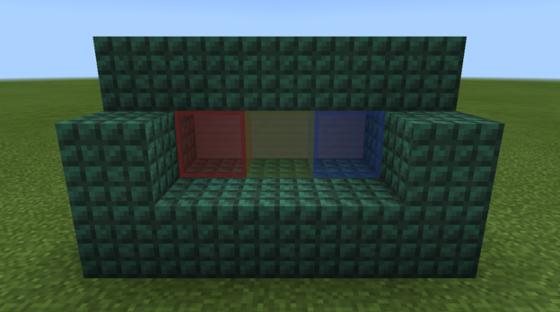
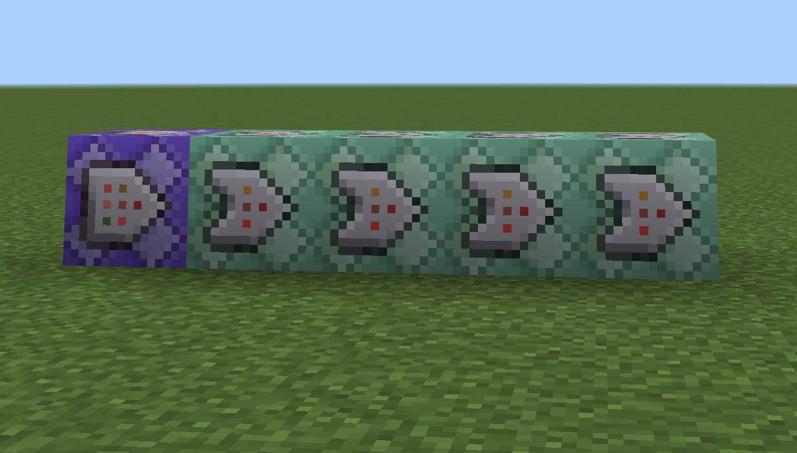

# Commands - How To Make a Complete the Monument Map

Now it’s time to create a complete command system: detecting the completion of a monument for a short “Complete the Monument” map.

In this tutorial you will learn the following:

> [!div class="checklist"]
>
> - How to apply what has been learned about commands to make a simple command system using some popular commands.

### Requirements

It’s recommended that the following be completed before beginning this tutorial.

- [Commands - Introduction](CommandsIntroduction.md)
- [Commands - Getting Started with Command Blocks](CommandBlocks.md)
- [Commands - Popular Commands](CommandsPopularCommands.md)

## The setup

An incomplete monument should be built at a static location. The 3 empty spaces in front of the stained glass indicates where wool is expected to be placed by the player when they collect it. The coordinates of these empty spaces are used for detection.



A scoreboard objective needs to be created to silently keep track of which colors of wool have been placed. This information must be stored to prevent the player from simply breaking one of the wool blocks and placing it back down to cheat and earn more rewards.

```
/scoreboard objectives add wool_placed dummy
```

Another objective is needed to store the total number of wool placed without conflicting with other scores, as will be detailed later on.

```
/scoreboard objectives add totals dummy
```

This information also cannot be stored on a per-player basis, as multiple players could be playing and at different times, so “fake” players will be used instead. A fake player is simply the name of a player that doesn’t exist in the world (and thus **cannot** be selected by target selectors). The `/scoreboard` command does not throw an error if no such player was found. Pre-pending the name with a hash (#) will prevent the fake player from appearing in the list of scores on the sidebar.

```
/scoreboard players set #red wool_placed 0
/scoreboard players set #green wool_placed 0
/scoreboard players set #blue wool_placed 0

/scoreboard players set #total_wool totals 0
```

Since repeating command blocks are going to be used, the chat is going to be flooded with command block output. This can be disabled using the “commandblockoutput” gamerule.

```
/gamerule commandblockoutput false
```

As well, when the player receives diamonds as a reward, a generic chat message will appear telling them they have been given items. This can also be disabled if desired, though be aware that some type of message to convey the reward may be beneficial to the player.

```
/gamerule sendcommandfeedback false
```

## Rewarding individual wool placements

Each of the following sets of commands will be placed in their own chains, being a copy of what is shown in the image below for each individual chain. The individual chains are very similar to one another, but each specifically detects the correct color of wool at the expected location. Note that all chain command blocks are set to conditional.



### Detecting red wool


1. A `/testforblock` command checks for the existence of red wool at the expected coordinates in the monument.
2. If the previous command successfully found the wool block, a `/scoreboard` command will check the score of the fake “#red” player. If the score is 0, that means the red wool hasn’t been placed before.
3. Since the red wool had yet to be placed, the player will receive a diamond for having done so.
4. And finally, the score of “#red” will be set to 1, indicating that the red wool has now been placed.

Be sure to replace `X Y Z` with the coordinates of where the wool will be placed in your own world.

```
/testforblock X Y Z wool 14
/scoreboard players test #red wool_placed 0 0
/give @a diamond
/scoreboard players set #red wool_placed 1
```

### Detecting green wool

The exact same process occurs as the red wool, except this time the commands are specific to green wool.

```
/testforblock X Y Z wool 13
/scoreboard players test #green wool_placed 0 0
/give @a diamond
/scoreboard players set #green wool_placed 1
```

### Detecting blue wool

The exact same process occurs as the red wool, except this time the commands are specific to blue wool.

```
/testforblock X Y Z wool 11
/scoreboard players test #blue wool_placed 0 0
/give @a diamond
/scoreboard players set #blue wool_placed 1
```

## Rewarding monument completion

Once the monument is complete, the player is rewarded with a stack of diamonds. In this case, some simple math can be used to determine if all wools have been placed. Since each of the fake players have a score of 1 after the wools is detected, if the sum of all fake players is 3, then all wools have been placed. The “+=” scoreboard operator can aid in obtaining the sum of scores.


1. The fake player named “#total_wool” first has their score set to 0. Since the `+=` operator adds one score to another, the score will increase more and more each tick. Setting it to 0 first is what will accurately give us the sum.
2. The += operator is used to tally up the scores of all players in the “wool_placed” objective (denoted by the asterisk `*`), and the result is stored as the score of the fake player “#total_wool” in the “totals” objective. If it were the same objective, then the value of “total_wool” might be added after the other scores have been added to it, giving an incorrect result.
3. The score of “#total_wool” is checked to see if it’s exactly 3. If so, this means all wools have been placed.
4. If the score was 3, all players will receive a stack of diamonds.
5. A command is needed in order to prevent the command block chain from constantly succeeding, since the sum will always be the same each tick. Setting the score of any wool color to be anything higher than 1 will cause the sum to be higher than 3, preventing the system from flooding the player’s inventory with diamonds. There are plenty of other ways to go about this, including disabling the command block chain in some manner.

```
/scoreboard players set ##total_wool totals 0
/scoreboard players operation ##total_wool totals += * wool_placed
/scoreboard players test ##total_wool totals 3 3
/give @a diamond 64
/scoreboard players set #red wool_placed 2
```

### What's Next?

Now that you have the hang of command systems, mixing them in with behavior packs can greatly increase the interaction between your players and your custom content. Learning about behavior packs is the next step.

> [!div class="nextstepaction"]
> [Introduction to Behavior Packs](BehaviorPack.md)
