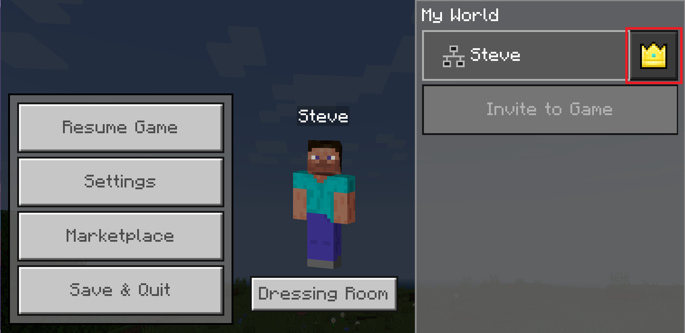
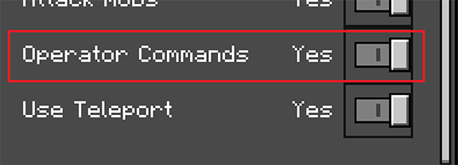
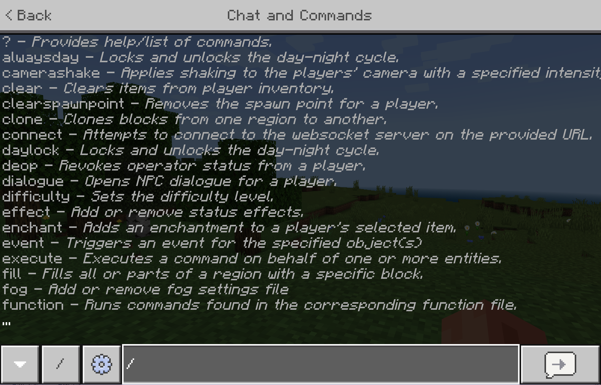
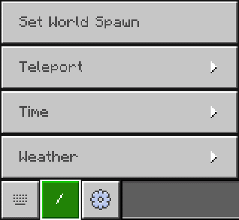

# Introduction to Commands

Commands are specific instructions that Minecraft will carry out. These instructions can be as simple as changing the time of day or as complex as setting up and working with a scoreboard. There are a wide variety of commands, and each have their own utility to improve your content.

The goal of commands with regards to content creation is to change or react to the environment around the player. Rather than having a static world, the player would be able to perform a task that a command system could detect and respond to in some way. An example of this is detecting if a player has placed a colored wool block at a specific location for a “Complete the Monument” style of map.

In this tutorial you will learn the following:

> [!div class="checklist"]
>
> - What commands are and how to begin using them.
> - Command syntax.
> - How to use target selectors and selector parameters.

## Enabling Commands

Before getting started with commands, cheats must be enabled. This can be done upon world creation or when editing a world. Be aware that enabling cheats will have the side effect of disabling achievements for that world.

Activating cheats will allow the use of commands in the chat interface. Running commands in the chat is essential for getting the first command block in the newly created world, which must also be enabled (in the same menu) in order to use them. Command blocks will be enabled by default, so you do not have to change that option.


While not required, it can be helpful to set the default game mode to creative when starting out as command blocks can only be edited in creative mode. Setting the default game mode to creative will also activate cheats.


Finally, you may need to enable the “operator commands” permission for yourself in order to run commands in the chat and access command blocks. While this setting is on by default for new worlds you create, you may need to change this on previously created worlds or for other players you would like to grant this permission for. This can be done by opening the pause menu while in the world and clicking the icon to the right of your player.



A list of various permissions will be shown. The “operator commands” permission in particular must be enabled in order to use commands in the chat and access command blocks.



## Using the chat for commands

The first step to learning commands is learning how to use the chat functionality. This is where you run simple commands, learn syntax, test, and ultimately open the gateway to command blocks. If your settings and permissions are set correctly, typing a forward slash `/` in the chat will display a large number of commands.



A quick-action button also becomes available to generate a command for specific situations (such as changing the time of day or the current weather).



As you type, the list of commands will shrink to match the characters you input. You can press `tab` to cycle through the list at any time in order to choose the command to run. Once the name of the command has been fully typed out, the list of commands changes to a list of syntaxes for the selected command.

## Command syntax

All commands follow the same grammar:

1. If the command is being run in the chat, it must start with a forward slash.
2. Following the potential forward slash is the name of the command.
3. Following the name is a space -- should there be any arguments after.
4. Following the space are any arguments for the command, each separated by a space.

For instance, with the following `/say` command, which is a command that will send a supplied message to the chat for all players to see:

```
/say Hello World
```

1. It starts with a forward slash.
2. It is then followed by the name of the command, “say”.
3. Since there are arguments after the name, a space is placed after the name.
4. Then, the only argument for `/say` is provided, which is the message to display.

As a result, “Hello World” will be printed out in the chat.

### Arguments

The arguments that a command has depends on which command is being used. The `/help` command will describe a command and the arguments it has. The auto-complete feature, which is available in the chat when typing out a command, will display the same information.

For example, running `/help testfor` in the chat will provide the available syntax for the `/testfor` command.

```
/testfor <victim: target>
```

The command has only one argument: a target to test the existence of. Filling in the argument with a player name and running the command will print out a success message if the player of the specified name is logged into the world.

```
/testfor PlayerName
```

There are 3 primary types of arguments: required, optional, and literal.

**Required arguments**

A required argument is surrounded by angle brackets. In the case of the `/testfor` command, the only argument it has is required because it is surrounded by angle brackets. If the argument is not provided, the command will fail to run. These types of arguments have a short descriptor of the argument as well as the expected input type. Consider the `/difficulty` command:

```
/difficulty <difficulty: Difficulty>
/difficulty <difficulty: int>
```

The only argument it has is required, as denoted by the angle brackets. The descriptor is “difficulty,” which hints that the input for the argument will be the difficulty to set the world to. After the colon is the expected type of input. With this argument, the input can either be one value from an enumeration (a list of expected values, including as “easy,” “normal,” and “hard,” labeled as “Difficulty”) or an integer that corresponds to a difficulty (0 through 3 respectively).

Either of the following commands will set the difficulty to hard.

```
/difficulty hard
/difficulty 3
```

**Optional arguments**

An optional argument is surrounded by square brackets. These arguments do not need to be provided. Like a required argument, it will contain a descriptor and an expected type.

```
/gamemode <gameMode: GameMode> [player: target]
/gamemode <gameMode: int> [player: target]
```

As with the `/difficulty` command, the `/gamemode` command has two equivalent syntaxes. The “gameMode” descriptor implies that the expected value is a game mode, while the actual type can either be one value from an enumeration (labeled as “GameMode”) or an integer corresponding to a game mode (0 through 2).

In this case, there is an optional argument after the game mode: the player that will have their game mode changed. The input type is “target,” which accepts either a player name or a target selector. Without supplying the optional argument, the command will still run. Doing so changes the game mode of the player who executed the command. By filling in the optional argument, the game mode of the target will be changed instead.

Either of the following commands will set the specified player (“PlayerName”) to survival mode.

```
/gamemode survival PlayerName
/gamemode 0 PlayerName
```

**Literal arguments**

A literal argument is one without a descriptor. The expected input is the name of the argument itself.  For example, with the `/time` command:

```
/time set <amount: int>
/time set <time: TimeSpec>
```

The “set” argument has no descriptor, which means it must be written out literally. It also contains no brackets, though it is still a required argument.

```
/time set 6000
/time set noon
```

A literal argument can have multiple accepted values. In those cases, a vertical bar separates the literal values. The `/weather` command makes use of this for the type of weather to apply, where the value of the argument must be one of the acceptable values.

```
/weather <clear|rain|thunder> [duration: int]
/weather rain 10000
```

An optional literal argument will be surrounded by square brackets. The final argument of `/testforblocks` is an optional literal argument that can be either “all” or “masked”. If none is specified, it defaults to “all”. The “masked” option will cause the comparison to ignore air blocks, allowing any block to exist at the destination where there would be an air block at the source.

```
/testforblocks <begin: x y z> <end: x y z> <destination: x y z> [masked|all]
/testforblocks 0 64 0 20 64 20 100 50 100
/testforblocks 0 64 0 20 64 20 100 50 100 masked
```

### Input types

Any argument that isn’t a literal argument will specify the expected input type after the descriptor.

```
/command <descriptor: type>
/command [descriptor: type]
```

There are a large number of input types. The most common ones are primitive numeric values, but there are many that are exclusive to one command. The table below details the most common input types and some popular commands they belong to. Most unique input types, such as “GameMode” from the `/gamemode` command, can easily have their input checked by using the auto-complete feature in the chat.

|Type|Description|Common commands
|-|-|-|
|Boolean|true or false.|`/effect`, `/gamerule`|
|int|An integer (1, 2, 3).|`/give`, `/scoreboard`, `/time`, `/weather`, `/xp`|
|float|A decimal number (1, 2.3, 4, 5.6).|`/spreadplayers`|
|string|Either a single word or text within "quotation marks".|`/scoreboard`, `/summon`, `/tag`|
|message|Text that does not need to be in quotation marks.|`/me`, `/msg`, `/say`, `/tell`, `/title`, `/w`|
|x y z|3 floats separated by spaces to specify coordinates.<br><br>Each value can also be a tilde (~), which indicates no change from the execution origin on that axis, or a tilde followed by a number (~5) to indicate the number of blocks away from the execution origin on that axis.|`/clone`, `/execute`, `/fill`, `/setblock`, `/summon`, `/teleport`, `/testforblock`|
|Block|A block ID.|`/clone`, `/execute`, `/fill`, `/setblock`, `/testforblock`|
|Item|An item ID.|`/clear`, `/give`, `/replaceitem`|
|EntityType|An entity ID.|`/summon`|
|json|JSON-formatted text.|`/give`, `/replaceitem`, `/summon`, `/tellraw`, `/titleraw`|
|target|Either a player name or a target selector.|`/clear`, `/execute`, `/gamemode`, `/give`, `/kill`, `/replaceitem`, `/scoreboard`, `/tag`, `/teleport`, `/testfor`|

## Target selectors

Using player names as values for arguments isn’t ideal for a command system that’s intended to work for anyone. It’s not possible to know the names of the players who will be making use of your content ahead of time. Target selectors, which can target players and other entities arbitrarily, fixes this issue.

There are 5 base selectors to pick from: `@p`, `@a`, `@r`, `@e`, and `@s`. The selector to choose depends on who or what the intended target is.

- `@p`: selects the single closest living player unless the execution origin is changed with the `x`, `y`, and `z` selector parameters. If the executor was a command block, the player closest to the command block would be selected since the command block’s coordinates are the execution origin.
- `@a`: selects all online players, alive or not.
- `@r`: selects one random living player unless the `type` parameter is specified.
- `@e`: selects all entities (players, cows, dropped items, etc.)
- `@s`: selects the executing entity, which can be changed with the `/execute` command.

Selectors replace a player name where possible. For example, instead of specifying a player name in the `/gamemode` command, a selector can be used in its place. The following would change the game mode of all players to creative mode:

```
/gamemode creative @a
```

If no targets are found by the selector, the command will fail to run.

### Selector parameters

Alongside the base selectors are parameters. These optional parameters help to narrow down the desired targets, such as if you wanted to only target players in adventure mode. All parameters are contained within a set of square brackets and each parameter is separated from one another with a comma. The name of the parameter is followed by an equal sign, which is then followed by the value of the parameter.

```
@<selector>[param1=value1,param2=value2]
```

If the desired targets of the previous `/gamemode` command should instead be all players in adventure mode, the `m` parameter will reduce the potential targets of the selector to only those in adventure mode. A list of all parameters can be found [below](#list-of-parameters).

```
/gamemode creative @a[m=adventure]
```

A potential target must match all specified parameters before being selected. This means that using `@p[tag=sometag,m=survival]` would select the closest player that has the tag “sometag” and is in survival mode.

#### List of parameters

|Parameter|Description|Example|
|-|-|-|
|`x, y, z`|Specifies the coordinates to find players from. Not all axes have to be specified.|Using `@p[x=0,y=64,z=0]` will select the player closest to those coordinates, rather than the player closest to the execution origin.|
|`r, rm`|Selects targets within a radius around the execution origin, unless changed by the “x, y, z” parameters.<br><br>`r` is the maximum number of blocks away from the origin to select, while `rm` is the minimum blocks away from the origin.<br><br>One may be specified without specifying the other.|`@p[x=0,y=64,z=0,r=1]` will select a player that is 1 block away from the specified coordinates.<br><br>`@a[rm=3]` will select all players 3 blocks away from the execution origin.<br><br>`@e[rm=3,r=10]` will select all entities that are between 3 and 10 blocks of the execution origin.|
|`dx, dy, dz`|Selects targets in a rectangular cuboid. The execution origin will be one corner while each of these parameters specifies the distance away from the origin to the other corner.<br><br>If any one of these parameters are specified, the others that are not specified will default to 0.|`@a[x=60,y=64,z=60,dx=5,dy=3,dz=5]` will select players that are 5 blocks within the X and Z directions and 3 blocks within the Y direction of the specified coordinates.<br><br>`@a[dy=50]` will select players that are within 50 blocks of the execution origin in the Y direction, while also being within 0 blocks in the X and Z directions. This means the player must be at the same horizontal position of the origin, but up to 50 blocks above it.|
|`c`|Changes the maximum number of targets that can potentially be selected. The targets chosen depends on the target selector's sorting.<br><br>Note that if there are fewer available targets than the value given to the parameter, the selector will still succeed in selecting those targets.|`@a[c=5]` will select, at most, the closest 5 players rather than all players. If there are only 3 players in the world, they will still be selected.<br><br>`@p[c=100]` will select up to the closest 100 players to the execution origin.<br><br>`@r[c=3]` will select up to 3 random players.|
|`type`|Selects targets based on their entity ID. This parameter cannot be used with `@a` or `@p` selectors.<br><br>Can be used with `@r` to target entities other than players.<br><br>The value can be negated to select targets that are not the specified entity.<br><br>Multiple of this parameter can be used to further restrict targets but only if the parameters are negated.|`@e[type=minecraft:bat]` will select all bats.<br><br>`@r[type=minecraft:cow]` will select one random cow.<br><br>`@s[type=!minecraft:player]` will select the executing entity if they’re not a player.<br><br>`@r[type=!minecraft:sheep, type=!minecraft:chicken]` will select one random entity that is not a sheep or chicken.|
|`m`|Selects players based on their game mode.<br><br>The value can be negated to select players that are not in the specified game mode.|`@a[m=survival]` will select all players in survival mode.<br><br>`@a[m=!creative]` will select all players that are not in creative mode.|
|`tag`|Selects targets who have the specified tag (given via the `/tag` command).<br><br>Can be negated to select targets that do not have the specified tag.<br><br>Multiple of this parameter can be used to further restrict targets.|`@e[tag=myfriend]` will select all entities with the “myfriend” tag.<br><br>`@e[tag=!myfriend]` will select all entities that do not have the “myfriend” tag.<br><br>`@a[tag=a,tag=b,tag=!c]` will select all players who have both the “a” and “b” tag, but only if they do not have the “c” tag.|
|`name`|Selects targets with the specified name, whether it’s a player name or the custom name of an entity.<br><br>Can be negated to select targets that do not have the specified name.<br><br>Multiple of this parameter can be used but only if the extra parameters are negated.|`@a[name=PlayerName]` will select all players named “PlayerName”.<br><br>`@a[name=!PlayerName]` will select all players that are not named “PlayerName”.<br><br>`@e[name=!a,name=!b]` will select entities that are not named “a” or “b”.|
|`l, lm`|Selects players between a minimum experience level (`lm`) and a maximum experience level (`l`).<br><br>One can be specified without specifying the other.|`@a[lm=10]` will select all players that have 10 or more experience levels.<br><br>`@a[l=15]` will select all players that have 15 or fewer experience levels.<br><br>`@a[lm=10,l=15]` will select all players that have an experience level between 10 and 15.|
|`rx, rxm`|Selects targets whose X rotation (pitch) is between a minimum rotation (`rxm`) and maximum rotation (`rx`). The pitch of an entity is between -90 degrees (facing straight up) and 90 degrees (facing straight down).<br><br>One can be specified without specifying the other.|`@p[rxm=45,rx=90]` will select the closest player who is looking down between a 45-degree angle and a 90-degree angle.<br><br>`@e[rx=-45]` will select all entities that are looking up between a 45-degree angle and a 90-degree angle.|
|`ry, rym`|Selects targets whose Y rotation (yaw) is between a minimum rotation (`rym`) and a maximum rotation (`ry`). The yaw of an entity is between -180 degrees and 180 degrees.<br><br>One can be specified without specifying the other.|`@a[rym=45,ry=135]` will select all players that are generally facing west.<br><br>`@a[rym=-180,ry=-180]` will select all players facing exactly north.|
|`scores`|Selects targets that have a particular score in an objective.<br><br>The parameter can specify multiple objectives within a set of curly brackets, with each objective separated by a comma.<br><br>A range between two inclusive values can be specified using “..” notation, such that “3..7” would check for a value between 3 and 7.<br><br>The value of a given objective can be negated to select targets who do not have a matching score value. Note that a null value is not equal to a negated value.|`@e[scores={objectiveA=3}]` will select all entities that have a score of 3 in the “objectiveA” objective.<br><br>`@a[scores={points=4,deaths=!5}]` will select all players that have a “points” score of 4, and do not have a “deaths” score of 5.<br><br>`@a[scores={points=10..50}]` will select all players who have a “points” score between 10 and 50.<br><br>`@a[scores={deaths=10..,points=..2}]` will select all players who have a “deaths” score of 10 or higher and a “points” score of 2 or lower.|
|`family`|Selects targets who belong to the family type, as defined in an entity's `minecraft:type_family` component.<br><br>The value can be negated to select targets that do not belong to the family type.<br><br> Multiple of this parameter can be used to further restrict targets.|`@e[family=skeleton]` will select all entities who belong to the “skeleton” family.<br><br>`@e[family=!monster]` will select all entities that do not belong to the “monster” family.|

### What's Next?

Now that you've learned about commands, the next step is learning about command blocks, which can run commands at will.

> [!div class="nextstepaction"]
> [Command Blocks](CommandBlocks.md)
