# Editor Overview

This overview is intended to introduce you to the parts of the Editor interface and the tools. The keyboard shortcuts, also known as keybindings, have been provided with each tool and in the table at the end of this document.

For a more in-depth experience using the tools to accomplish basic tasks, take a look at the [Editor Tutorial](EditorTutorial.md).

> [!IMPORTANT]
> Just like we add features to the Minecraft game from time to time (like new blocks), Minecraft Editor is still under active development.
> It will change as we get feedback from creators like you.

--------

In this manual, you will learn the following:

> [!div class="checklist"]
>
> - What the difference is between a project and a world
> - How to create a project
> - How to customize the user interface and project world settings
> - What all the parts of the UI are and where to find them
> - How to save a project
> - How to open an existing project
> - How to export a project as a world
> - How to open a world created from a project
> - Where Editor stores exported and saved files

--------

## Requirements

To get started, you need the following:

- A Windows 10 (or higher) computer with Minecraft Bedrock Editor
- Keyboard and mouse

> [!IMPORTANT]
> Editor is not available on mobile.

It's recommended that the following be completed before beginning this tutorial.

- [How to get Minecraft Bedrock Editor](EditorInstallation.md)

## Creating an Editor Project

After you launch the Editor from the shortcut, you get a screen that says "Create New Project."

While you're creating a project, you can configure the name, export settings, and the usual settings for a Minecraft world.

Export settings will apply when you export as a playable world from the Editor (.mcworld).

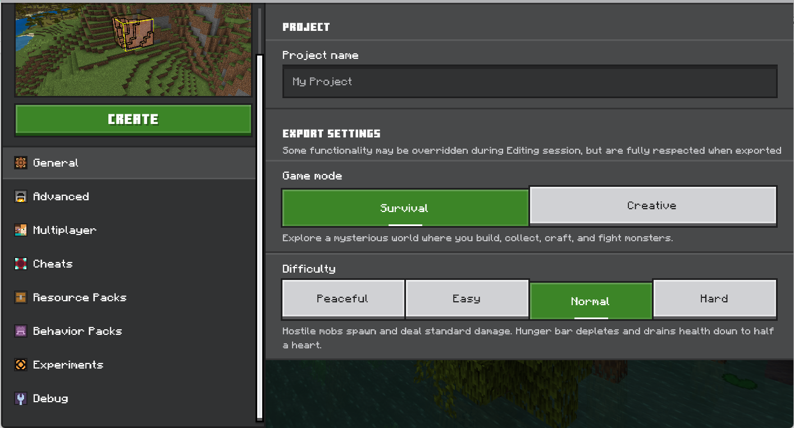

New projects load with a Welcome/Quick Start screen. If you close it and you want it open again, go to the Help menu and select Quick Start.

## First Things First: UI Settings

Editor looks like your usual Minecraft game with a user interface (UI) on top of it. Before we get started, let's make sure that UI looks okay for your monitor resolution and preferences.

Go to the **File** menu and select **UI Settings**.

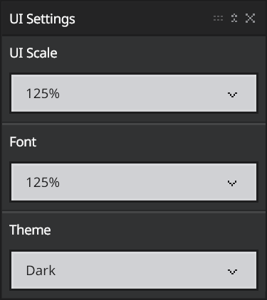

>- UI Scale - Makes the menu bar and windows larger or smaller in relation to the project world.
>- Font - Changes the size of the text in the windows.
>- Theme - Changes the colors used in the UI.

After you make a selection from the UI Settings menu, your changes are reflected immediately.

Hint: If you accidentally adjust things to where you can't read the settings to fix it, press the `Alt F4` keys on your keyboard to close Editor. Then, launch Editor again and create a new project. (This is part of why we're doing this first.)

Editor works with [Minecraft Accessibility](https://www.minecraft.net/accessibility) features.

When you're happy with the UI Settings, you can click the X to close the UI Settings window.

## Editor UI Windows: Move, Minimize, Close

You can move Editor windows by clicking and dragging them by the title bar.

Click the double "up arrows" in the corner to collapse the windows upwards so you can tuck them out of the way if you don't want to close them.

If you do want to close the window, click the X in the corner. Some windows can be re-opened with a keyboard shortcut.

## Welcome/Quick Start

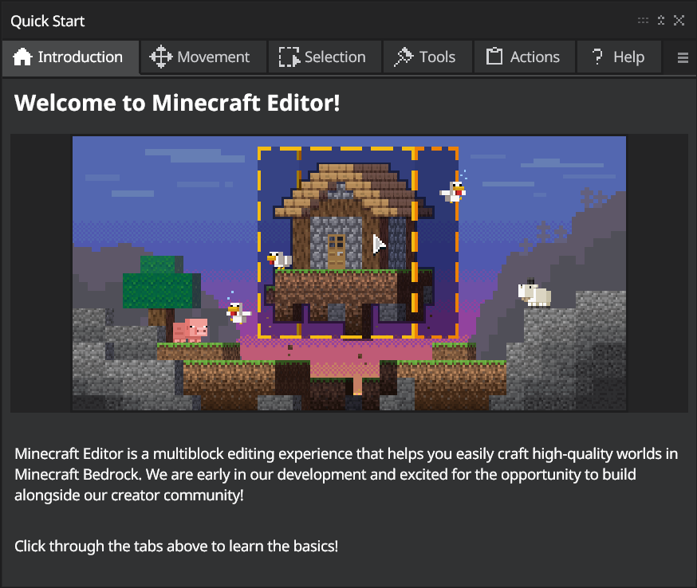

**Introduction**

Welcome to Minecraft Editor!

Minecraft Editor is a multiblock editing experience that helps you easily craft high-quality worlds in Minecraft Bedrock. We are early in our development and excited for the opportunity to build alongside our creator community!

Click through the tabs above to learn the basics!

**Movement**

Hold down your right mouse button on the viewport to enable movement.

Move horizontally using `W A S D`.

Move vertically using `Shift` or `Space`.

**Selection**

Left-click anywhere in the world to select a single block.

Use the gizmo or hold Shift between left-clicks to place opposite corners of an area.

Press Ctrl to make additional selections.

Move using the gizmo, or hold down Alt and move with arrow keys (horizontal) and page up/page down (vertical).

Resize using corner gizmos, or hold Ctrl (increase) or Shift (decrease) with arrow keys and page up/page down.

**Tools**

Select the brush from the left toolrail.

Left-click and drag to paint.

**Actions**

Undo (`Ctrl Z`) or redo (`Ctrl Y`) your edits.

Cut (`Ctrl X`) or copy (`Ctrl C`) a selection.

Select a single block and quick paste (`Ctrl V`) what you cut or copied.

Or, paste preview (`Ctrl Shift V`) and use arrow keys and page-up / page-down for precise placement.

**Help**

Editor will be exclusively available in Bedrock Preview until the feature set and quality meets our standards to be made visible in the Launcher.

- Documentation
- Log issues and give feedback

You may close this panel. To reopen at any point, select "QuickStart" from the top "Help" menu.

## Tool Mode and Crosshair Mode

The two modes within Editor are Tool Mode and Crosshair Mode.

**Tool Mode** has multi-block editing tools and the user interface. When you move the mouse without holding any mouse buttons, your cursor is freely available to use the user interface.

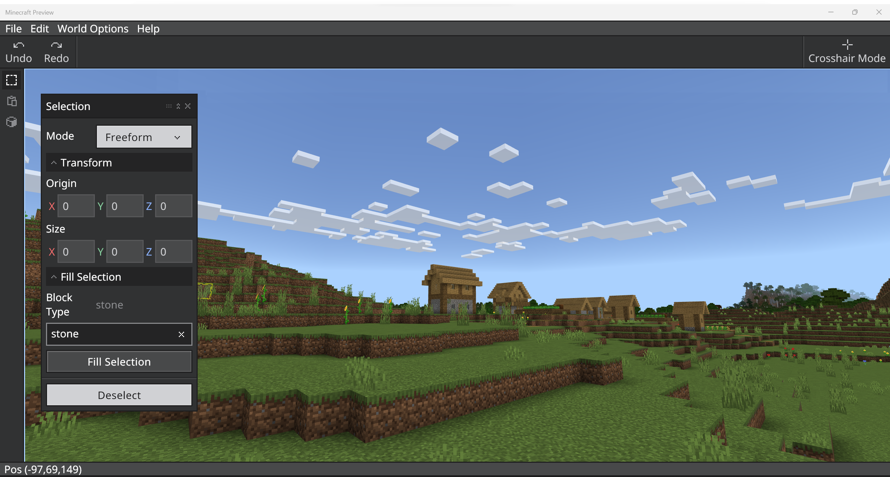

**Crosshair Mode** has more precise, single-block editing capabilities. It also uses the usual Minecraft keybindings you can see on the Settings > Controls > Keyboard & Mouse screen. When you move the mouse, you look around.

In a new project, before you touch anything, you are in Tool Mode.

If you're ever not sure which mode you are in, press ESC. If you're in Crosshair mode, you'll go back into Tool Mode - if you're in Tool Mode already, nothing will happen.

Practice: In the top right corner of the screen, select the “Crosshair Mode” button or press `Ctrl Tab` to go into Crosshair Mode. Note the differences. To go back to Tool Mode, you can press `Ctrl Tab` again or press `Esc`. You can also go from Tool Mode to Crosshair Mode by clicking the Crosshair Mode button in the upper right corner.

## Navigation

Before we dive into the Tool Mode UI, you might want to take a moment to familiarize yourself with how to look around and move around in the different modes.

- Unlock the camera: In Tool mode, hold down the right mouse button to look around. In Crosshair Mode, you do not need to hold down the right mouse button.  

- Moving around: In Tool Mode, hold the right mouse button down while you press `W`, `A`, `S`, `D`, `Space`, and `Shift` keys. You do not need to hold down the right mouse button to use the same keys to move around in Crosshair Mode.

- Look-to-teleport: In Tool Mode, point your cursor at a block in the distance, and hit `G` on your keyboard. You will be "Grapple teleported" there. This function does not work in Crosshair Mode.

## Tool Mode Overview

Think of the Tool Mode UI as a collection of containers. The menu bar contains menus. The action bar contains buttons that do simple functions like Undo and Redo. The toolrail contains more complicated tools that have their own configuration windows where you can change the settings.

The contents of these containers will change as Editor is developed.

**Menu bar**: At the top of the screen. Currently has File, Edit, World Options, and Help.

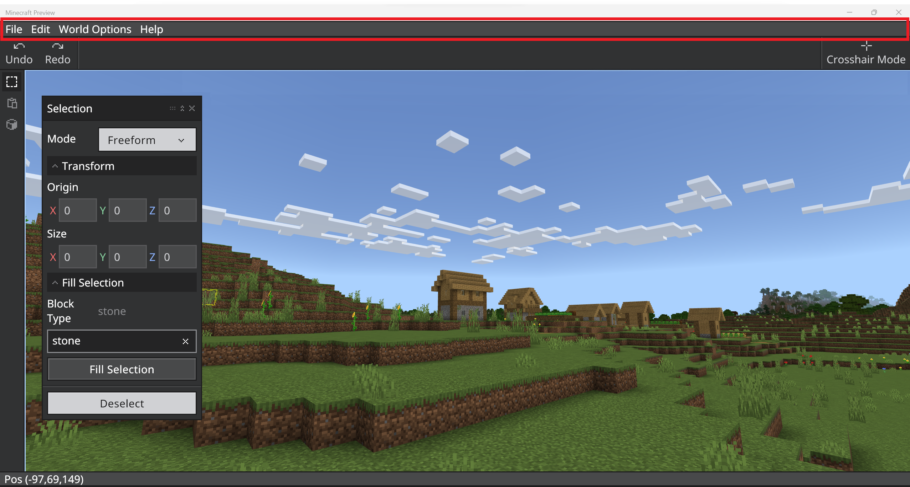

**Action bar**: Below the menu bar. Currently has undo and redo buttons that affect the things you do to the world, including some of the actions you do in Crosshair Mode.

**Toolrail**: Left side of the screen. Currently holds Selection, Paste Preview, and Brush. You can also select these tools using keyboard shortcuts.

## Menu bar

### File menu

**Export as** - When you're ready to share your project (or just see it in non-Editor Minecraft) selecting **File > Export as > Playable world** to start the process to create a .mcworld file in the **projectbackups** folder inside the **com.mojang** folder in your computer.

If you don't know how to find your com.mojang folder, there are instructions in the Bedrock [Getting Started](/GettingStarted.md) tutorial.

Editor has its own filetype: .mcproject. These files will always open in Editor, if you have it installed.  

To **import** projects, go to the Create New Project screen and click the import button to the right of the Create New Project button.

Navigate to a .mcworld, .mctemplate, or .mcproject files.
After the file is imported, it is converted to an .mcproject file.

If you want to learn more about Minecraft file types like .mcproject and .mcworld, there is more information on the [Minecraft File Types](/MinecraftFileExtensions.md) page.

**UI settings** - This is where you can adjust the UI Scale, Font, and Theme color settings of the Editor UI.

**Pause screen** - This option brings up the Minecraft pause screen where you can edit game settings (like music volume) or Save & Quit.

### Edit menu

As you work in Tool Mode, these familiar functions (along with their keyboard shortcuts) are available to help you.

|Command  |Shortcut  |
|:-------|:---------|
| Undo | `Ctrl Z` |
| Redo | `Ctrl Y` |
| Quick Fill | Select an area and either `Ctrl F` while in Selection mode or use Fill in the Selection panel |
| Deselect | `Ctrl D` or use the Deselect button in the Selection panel |
| Cut | `Ctrl X` |
| Copy | `Ctrl C` |
| Quick Paste | `Ctrl V` |
| Delete | `Delete` |

This menu is also a good place to go for a reminder about these keyboard shortcuts.

### World Options

**Actors** - If you want to pause or unpause actors like mobs.

**Change dimension** - You start in the Overworld by default. Go here to change to the Nether or the End.

**Daylight cycle** - Turn off to set the time of day to noon and stop time there. Turn on to start the day/night cycle again.

#### Help

**Quick start** - If you want the welcome screen back, select this.

**Documentation** - This is a handy link to the document you are reading right now (among others).

**Feedback** - This is the link to the GitHub site where you can share feedback.

### Action bar

The Action Bar has quick functions like undo and redo that affect the things you do to the world, including some of the actions you can do in Crosshair Mode.

|Command |Shortcut |
|:-------|:-------|
| Undo | `Ctrl Z` |
| Redo | `Ctrl Y` |
| Crosshair Mode| `Ctrl Tab` |

### Toolrail

These are some of the tools you can use to edit your world and some quick steps to practice using each tool.

Only one window can be open at a time and you can use the keyboard shortcuts to switch among them.

Practice: Tool window switcheroo

1. Press `Ctrl B`, `Ctrl S`, and `Ctrl Shift V` in any order to get used to switching among the tools.

### Selection

`Ctrl S` opens the Selection tool window.

The selection tool is used to select any of the blocks in the world, including air.

The Selection window that you use to configure the selection tool has sections where you can change the selection mode, transform the selection, fill the selection with blocks, or deselect your selection.

### Selection Modes

**Freeform** mode creates a selection area when you choose the x, z, and y coordinates, in that order. It can include air in the selection, but you can only click on a non-air block to choose it as a coordinate.

There is more than one way to specify the coordinates in Freeform mode, and they will all be explained fully, along with the helper features called **gizmos**.

For now, let's learn one way to create a selection in Freeform mode.

Freeform mode practice:

1. Make sure "Freeform" is showing in the Mode drop-down menu of the Selection window.
1. Left-click a block on the ground in front of you with your cursor. This chooses the block that will hold the x coordinate.
1. Hold down the `Shift` key and click another block. This chooses the z coordinate. A square with x and z as opposite corners will be drawn on the ground.
1. To add the y coordinate, hold down the `Alt` key and click somewhere above the x, z selection square.
1. Click the Deselect button (or `Ctrl D`) before moving on to the next practice.

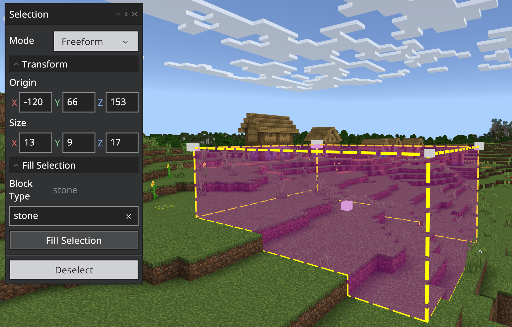

**Fixed Distance** mode can select blocks, air, or a combination of both.
You can use the scroll wheel on the mouse to increase or decrease the distance between you and the selection cube.
Fixed distance is the easiest mode to use if you want to select only air blocks.
Like Freeform selection, you build the selection shape by selecting the x, z, and y coordinates (in that order).

Fixed Distance mode practice:

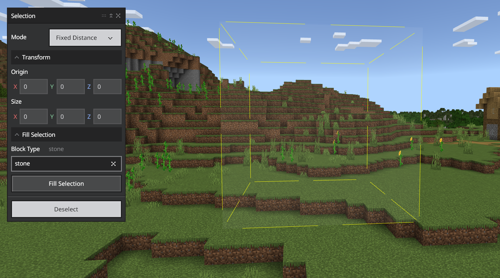

1. Make sure "Fixed Distance" is showing in the Mode drop-down menu of the Selection window. You should see a thinly-outlined cube shape in front of you.
1. Hold down the right mouse button and look around the world. Notice how the pre-selection cube moves around.
1. Next, roll the mouse's scroll wheel back and forth to see how the fixed distance pre-selection cube changes size and position.
1. Click the ground to set your x coordinate.
1. Hold the shift key and click the ground a little distance away to choose your z coordinate.
1. Alt-click above the x z square.
1. Click the Deselect button (or `Ctrl D`) before moving on to the next practice.

**Adjacent** mode selects only the air next to, above, and below solid blocks.

Adjacent mode practice:

1. Make sure "Adjacent" is showing in the Mode drop-down menu of the Selection window.
1. If you move the mouse around, you will see the thin, pre-select cube move around on top of the ground.
1. Left-click to confirm your choice of where to create the selection.
1. Click the Deselect button (or `Ctrl D`) before moving on to the next practice.

**Transform**

In the Transform section, you can fine-tune your selection by entering Origin coordinates or changing the Size.

Practice transforming the origin of the selection:

1. Create a selection with any of the selection modes.
1. Look in the lower left corner of the UI to see the Pos (position) coordinates. These are the coordinates of where you are standing.
1. Compare the position coordinates with the x, y, and z coordinates in the Origin section.
1. Increase the x coordinate and press enter. Notice how the selection moves.
1. Change the y and z coordinates and notice how the selection is affected.
1. Click the Deselect button (or `Ctrl D`) before moving on to the next practice.

**Size**

Practice changing the size of the selection:

1. Create a selection with any of the selection modes.
1. Increase or decrease each coordinate and notice how the size of the selection is affected.
1. Click the Deselect button (or `Ctrl D`) before moving on to the next practice.

**Fill**

1. Create a selection with any of the selection modes.
1. Notice the Block Type. The default is stone.
1. Click the Fill Selection button to fill the current selection with stone.
1. Deselect the shape and move to another area.
1. Make another selection.
1. Click the Search field and select a different block type.
1. Click the Fill Selection button to fill the current selection with the different block type.

**Gizmos**

Create a selection and click on a corner of the selection box. You will see a little cube with arrows appear. That's a **Resize Gizmo**! You can click and drag these arrows to adjust the size of your selection box.

You might also see another box hovering in the center of the selection. That's a **Move Gizmo** and you can drag it around to move your selection.

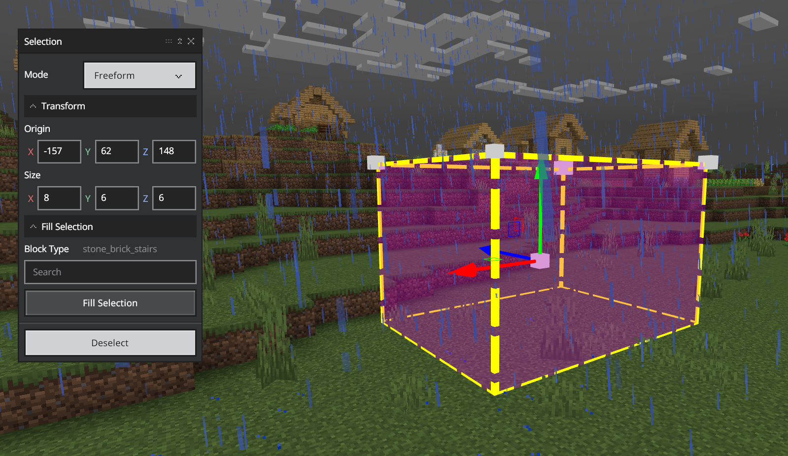

### Paste Preview

`Ctrl Shift V` opens the Paste Preview window.

After you create a selection and copy it (`Ctrl C`) or cut it (`Ctrl X`), you can use the Paste Preview window to change how the selection will appear when you paste it.

1. Select something interesting, like a village house, with any of the selection modes.
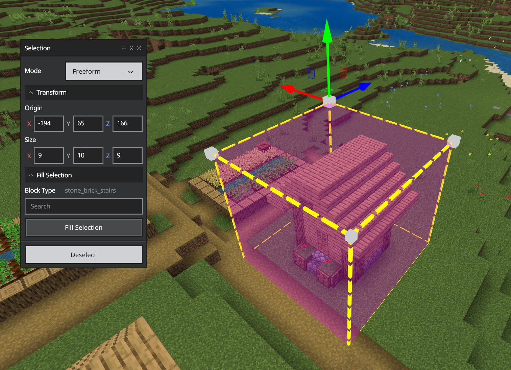
1. Copy or cut the selection (`Ctrl C` or `Ctrl X`).
1. Open the Paste Preview window (`Ctrl Shift V`).
1. Click the ground where you want the copied or cut blocks to be pasted. The paste preview selection is displayed.

1. You can use the arrow keys and the page up/page down keys to move the paste preview box to exactly where you want it.
1. Click Confirm Paste.
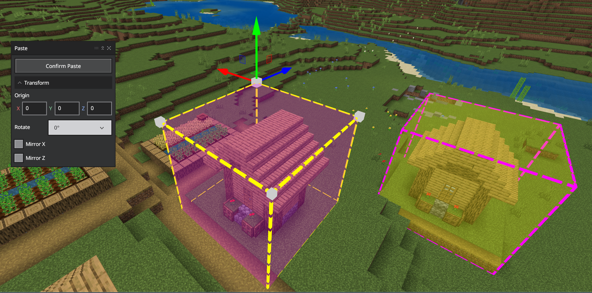

You can Transform your copied selection by editing the Origin coordinates, Rotating the selection, or mirroring the selection along the x or z axis.

Click Confirm Paste after each transformation to place a selected object.

#### Brush

`Ctrl B` opens the Brush tool window.

The Brush tool is used to draw shapes with a selected Block Type.

You can change the Brush Size, ranging from 1 to 16. Brush sizes are rendered as squares of the selected brush size. This means a brush size of 1 draws a 1x1 block shape. If you select a brush size of 3, you get a 3x3 block shape, or 9 total blocks arranged as a cube.

If you choose a brush size larger than 3, you can select the Hollow checkbox to make the block shape hollow.

If the Face Mode checkbox is selected, the brush cursor acts like the Adjacent selection cursor - meaning you can select the air above a solid block to draw your blocks. This should make it easier to build up shapes from the ground - like mountains!

Practice 1: A humble tree...

1. Move to a clear area.
1. Set the Brush Size to 1, check the box for Face Mode, and choose 'log' for the Block Type.
1. Find a clear place on the ground and place one log block.
1. Draw another log on top of that one.
1. Draw two more log blocks on top of each other to create a tree trunk.
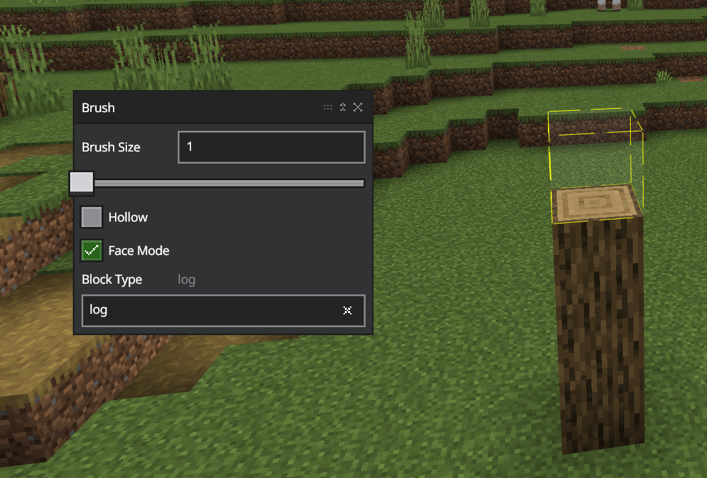
1. Change the Block Size to 3 and the Block Type to 'leaves' and click the top of your log blocks to put leaves around the top of your tree.
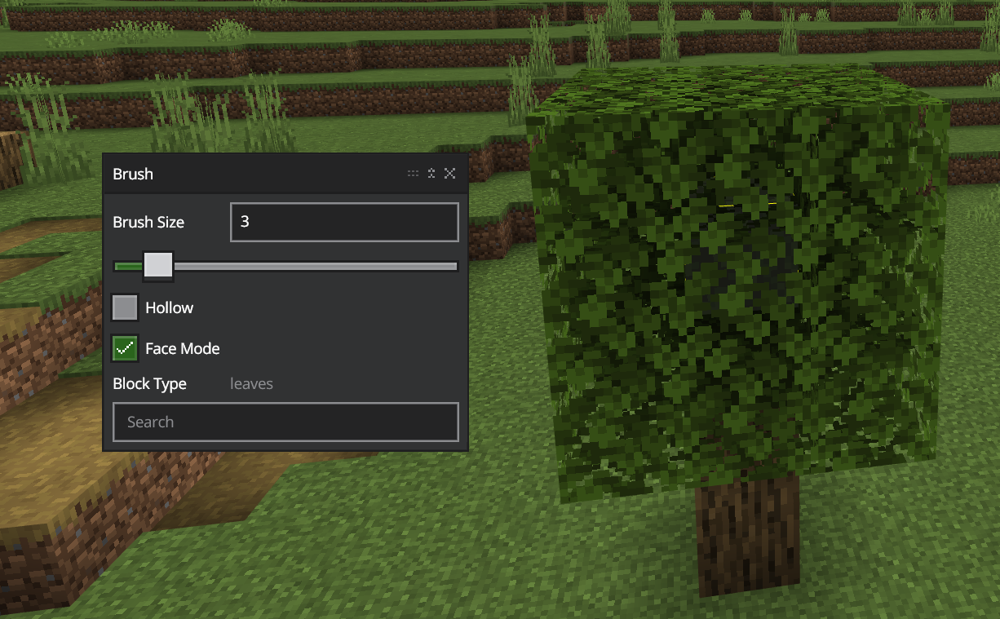

Practice 2: Is it really Hollow?

1. Move to a clear area.
1. Change the Brush Size to 16.
1. Check the box for Hollow.
1. The box for Face Mode should be checked, too.  
1. Set the Block Type to 'glass'.
1. Click the ground once to draw a 16x16, hollow glass shape. You should find yourself inside a huge, glass house.

## Crosshair Mode

Crosshair Mode is intended for making small single-block edits and placing entities and mobs.

Practice:

1. Click the Crosshair Mode button (or `Ctrl Tab`) to go into Crosshair Mode.
1. Use commands to summon a horse (`/summon horse`) and give yourself a campfire (`/give @s campfire`).
1. Place a campfire where it won't hurt the horse.
1. Go back to Tool Mode and notice that pausing and unpausing actors affects the horse and not the campfire.
1. Use Undo (`Ctrl Z`) and Redo (`Ctrl Y`) in each mode to make the campfire disappear and reappear. Notice that the horse is unaffected.
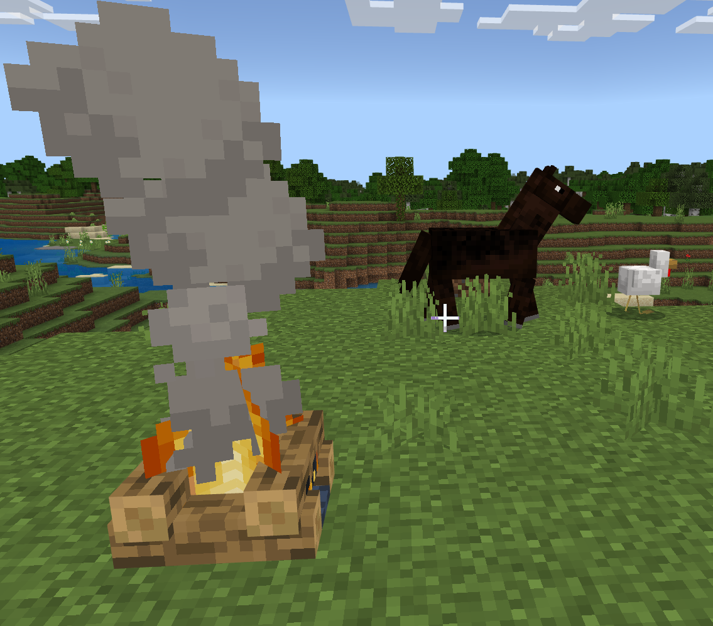

## Keyboard shortcuts

| Action | Keyboard Shortcut | Mode |
|:----|:----|:----|
| Forward | `W` (_*Tool: Hold down right mouse button_) | Tool + Crosshair |
| Left | `A` (_*Tool: Hold down right mouse button_)| Tool + Crosshair |
| Backward | `S` (_*Tool: Hold down right mouse button_)| Tool + Crosshair |
| Right | `D` (_*Tool: Hold down right mouse button_)| Tool + Crosshair |
| Up | `Space` (_*Tool: Hold down right mouse button_)| Tool + Crosshair |
| Down | `Shift` (_*Tool: Hold down right mouse button_)| Tool + Crosshair |
| Increase speed | Quickly press `W` twice (_*Tool: Hold down right mouse button_)| Tool + Crosshair |
| Fly toggle | Quickly press `space` twice | Crosshair |
| Display 3D cursor - baseline for Tool Mode | `Esc` | Tool only |
| Selection mode | `Ctrl S` | Tool only |
| Selection: Single block | Single left mouse click | Tool only |
| Selection: 2-step XZ region selection | Left mouse click while holding `Shift` | Tool only |
| Selection: 3-step XZY region selection | Left mouse click while holding `Shift` for XZ, and to select Y move your cursor and press `Alt` while left clicking | Tool only |
| Deselect | `Ctrl D` | Tool only |
| Fill | Select an area and either `Ctrl F` while in Selection mode or use Fill in the Selection panel | Tool only |
| Undo | `Ctrl Z` or `Ctrl Delete` (if `/effect` is applied) | Tool + Crosshair |
| Redo | `Ctrl Y` | Tool + Crosshair |
| Cut | `Ctrl X` | Tool only |
| Copy | `Ctrl C` | Tool only |
| Paste | `Ctrl V` | Tool only |
| Delete | `Delete` | Tool only |
| Grapple teleport | Point at something and press `G` | Tool only |
| Brush | `Ctrl B` | Tool only |
| Open cmd window | `/` | Tool + Crosshair |
| Toggle from Tool to Crosshair Mode | Crosshair Mode button or `Ctrl Tab` | Tool only |
| Toggle from Crosshair Mode to Tool | `Esc` | Crosshair only
| Get to Tool Mode from Crosshair Mode | `Esc` | Tool only |

## Editor File Operations - Create, Import, Export

Here are the steps to create a project, make a quick edit, export the file, and then open that file in Minecraft and then again in Minecraft Editor.

1. Launch Minecraft Bedrock Editor.
1. Select "Create New Project."
1. Name the project something meaningful like "Editor Test Project" and open it up.
1. Select the brush tool (`Ctrl B`) and draw something by clicking on the ground a few times.
1. Go to the **File** menu and select **Export as ... Playable world**.
1. You will see some messages confirming that the export started and finished, and a temporary chat message will display the path to a folder in your **com.mojang** folder called **projectbackups**.
1. Close Editor by going to **File ... Pause screen** and then choose **Save & Quit** like you usually do.
1. Go to the **projectbackups** folder in your **com.mojang** folder. You should find a file with the name you gave it appended to the date, time, and a **.mcworld** extension.

If you need a reminder about how to find the **com.mojang** folder on your computer, there are some steps in the [Getting Started](GettingStarted.md) article.

The **projectbackups** folder does not exist until the first time you export a project from Editor. 

If you're curious about Minecraft file extensions, there is an article about them called [Minecraft File Extensions](mMinecraftFileExtensions.md) where you can learn more.

1. If Editor is closed, then when you double-click the **.mcworld** file Minecraft will launch like usual and import the .mcworld file. The world you created in Editor will be listed among any other Minecraft worlds you already have. However, if Editor is still running, then double-clicking the file will cause it to be imported into Editor instead.
1. To send your project file to someone else so they can work with it in Editor, go back to the **projectbackups** file in your com.mojang folder.
1. Copy and paste the file and change the file extension to **.mcproject**. When you send this file to someone else, they can double-click it to open it directly in Editor (if they have Editor installed.)

### Importing a file into Editor

1. Launch Editor and click the Play button.
1. Click the import icon next to the Create New Project button to open the Windows file explorer.

 

3. In the file explorer, choose the .mcworld, .mctemplate, or .mcproject you want to import.
4. When the file is imported, a success message is displayed.
5. The newly imported map will be available in the list.
6. Open the map. It will load into Editor with default settings, which can be modified within Editor.

### File structure information

As you probably already know, when you create a world in Minecraft, that world is stored in the **minecraftWorlds** folder in your **com.Mojang** folder.
When you create a project in Editor, that file is also a world, so it is also stored in the **minecraftWorlds** folder but it is invisible to non-Editor Minecraft unless you import it.
The Editor project file goes into the **projectbackups** folder only when you export it.

## What's Next?

Now that you know more about the parts of Editor, let's use the tools to do some editing!

> [!div class="nextstepaction"]
> [Editor Tutorial](EditorTutorial.md)
