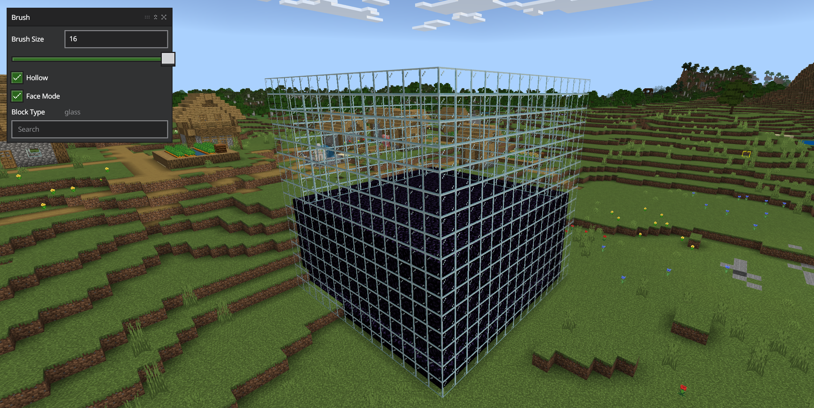
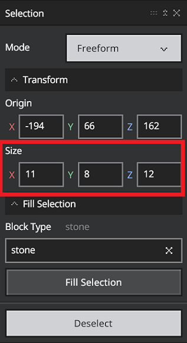
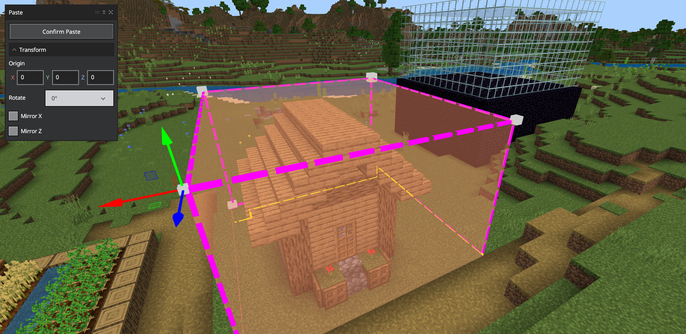
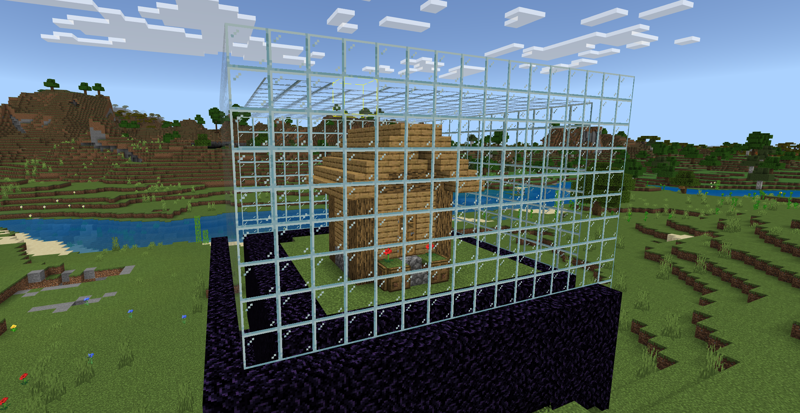
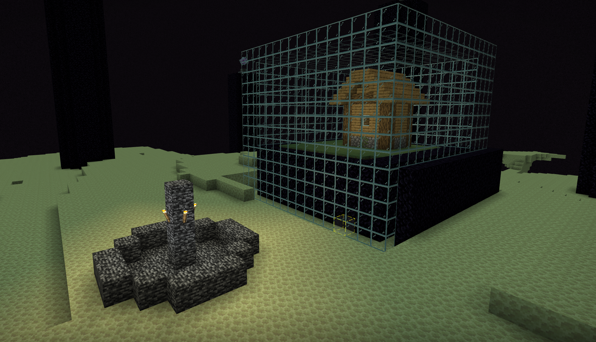

# Minecraft Editor Tutorial

This tutorial is intended to guide you through using Mineraft Bedrock Editor to accomplish a variety of tasks. Before you begin, you should know how to launch Editor, create a project, move around, and switch between the two modes.

There will be some hints about using keyboard shortcuts and which commands should make things easier.

> [!IMPORTANT]
> Just like we add features to the Minecraft game from time to time, Minecraft Editor is still under development.
> It will change from time to time as we get feedback from creators like you.

--------

In this tutorial, you will learn the following:

> [!div class="checklist"]
>
> - How to use each tool in Editor, along with its variations and keyboard shortcuts

--------

### Requirements

To get started, you need the following:

- A Windows 10 (or higher) computer with Minecraft Bedrock Editor
- Keyboard and mouse

> [!IMPORTANT]
> Editor is not available on mobile.

It's recommended that the following be completed before beginning this tutorial.

- [How to get Minecraft Bedrock Editor](EditorInstallation.md)
- [Bedrock Editor Overview](EditorOverview.md)
- [Commands Introduction](CommandsIntroduction.md)
- [Popular Commands](CommandsPopularCommands.md)

## A Village Building in a Glass Box

In this tutorial, we are going to select a building from a village and put it into nice, safe glass structure.

1. Launch Editor and create a new project with seed: `2123293805289839865`. You don't *have* to use this seed, but it spawns you within sight of a village that has a nice variety of buildings and not too many trees - which is what we want for this project.
1. Close the Welcome screen if it is open.
1. Go to the World Options menu and turn the Daylight cycle **off** if you don't want to work in the dark.
1. Navigate over to the village near coordinates (-161, 68, 171). Hint: try using the grapple teleport (`Ctrl G`) to get over there.
1. Find a clear area near the village. We are going to build a glass enclosure on a base. First, we build the base.

1. Open the Brush tool (`Ctrl B`).
1. Set the Brush Bize to 16 and set the Block Type to something decorative like obsidian. The checkboxes for Hollow and Face Mode should be unchecked.
1. Click the ground once in the clear space to create a 16 by 16 base. If you're not happy with the placement, you can undo that step with `Ctrl Z` and try again.

1. When you're happy with the base, change the Block Type to glass and check the boxes for Hollow and Face Mode. The size should stay 16.
1. Click the center of the base to place a hollow glass structure.

1. Use the Selection tool (`Ctrl S`) to select an entire building and some of the ground around it. Hint: If you don't have a favorite Selection mode yet, try using Freeform to select the ground first and then use the resize gizmos to make the selection big enough.

1. The selection size should be smaller than 15 blocks so that it can fit inside the glass. Look at the Size section of the Selection tool and confirm that the numbers for x, y, and z are all less than 15.

1. Copy the selected house (`Ctrl C`) and open the Paste Preview tool (`Ctrl Shift V`).

1. Move back over to the glass structure and go inside.

1. Click in the center of the base and use the arrow keys to move the Paste Preview outline so that it is completely inside the glass.

1. Click Confirm Paste. Click another tool to get rid of the paste selection outline.

## A Village House in a Glass Box in the Nether

1. Select the entire glass and obsidian structure with the house inside that was created in the previous tutorial.

1. Copy the selection.
1. Go to the World Options menu, go to Change dimension, and select Nether.
1. Inside the Nether, find a clear spot.
1. Open the Paste Preview tool (`Ctrl Shift V`).
1. Click the ground to place the Paste Preview outline.

1. Click Confirm Paste. If you don't want to paste more glass boxed houses, select a different tool to get rid of the Paste Preview outline.

## A Village House in a Glass Box in the End

1. With the glass, obsidian, and house structure copied onto the clipboard, change the World Option dimension to the End.
1. Use Paste Preview to place the house somewhere interesting.

## What's Next?

Now that you have gone through the Tutorial, here are some articles about commands and structure blocks.

> [!div class="nextstepaction"]
> [Commands Introduction](CommandsIntroduction.md)
