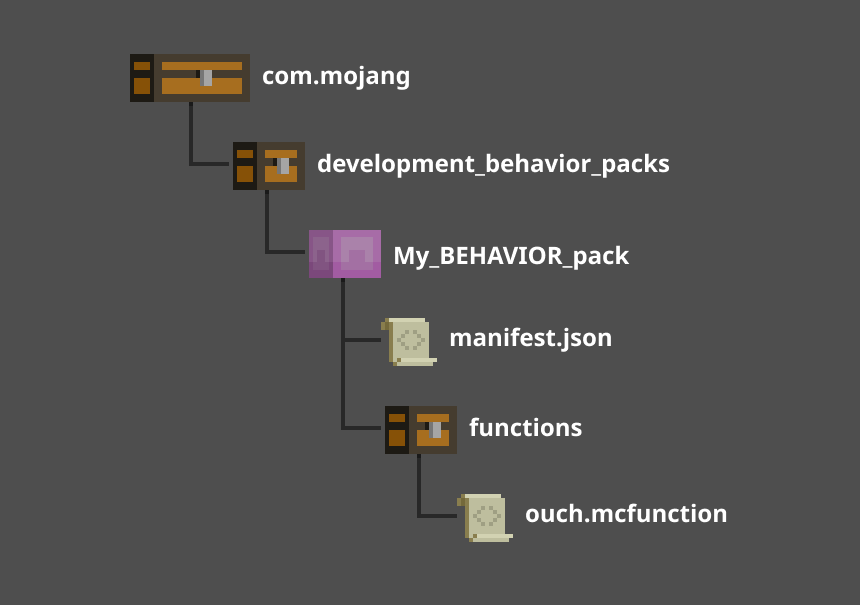

# Introduction to Functions

Commands are powerful tools for adding logic and gameplay features. However, redstone and command blocks can be cumbersome. With function files, you can group together multiple commands into a single file and execute all of them with a single command.

>[!Tip]
> Minecraft: Bedrock Edition **cannot** run more than 10,000 commands in one function call.

In this tutorial you will learn the following:

> [!div class="checklist"]
>
> - How to create a function file.
> - How to use a function file in-game.

### Requirements

It's recommended that the following be completed before beginning this tutorial:

- [Introduction To Behavior Packs](BehaviorPack.md)
- [Introduction to Commands](CommandsIntroduction.md)

You will also need the following:

- Your own behavior pack folder that already contains a `manifest.json` file.
- A Minecraft world with cheats enabled.

## Setting up the Functions Folder

Function files have a .mcfunction extension and they live in the **functions** folder of your behavior pack.



1. Start by creating a folder inside your behavior pack and name it **functions**. This folder should be on the same level as your `manifest.json` file.
1. Open the **functions** folder and create a text file.
1. Name the file **ouch.mcfunction**.
1. Open the file, then copy and paste the following code into it:

    ```json
    say Bye...
    playsound random.explode
    teleport @s ~10 ~10 ~10 true
    say OUCH!
    ```

1. Save the file.

>[!IMPORTANT]
> When working with commands in a .mcfunction file, you do not need to start commands with the leading slash `/`.

## Testing the function

1. Launch Minecraft.
2. Open a world with cheats enabled and the behavior pack you created applied to it.
3. Enter `/function ouch`.

## Advanced function feature

You can place functions inside directories to organize them and to avoid conflicts with functions in other behavior packs.

For example, if you have another folder inside your functions folder called **init** and you put `ouch.mcfunction` in there, you would run it like this:
`/function init/ouch`

## What's Next?

Now that you have an overview of how a function file works, you can learn how to use the in-game tick function and a `tick.json` file to fire off custom functions on repeat.

>[!div class="nextstepaction"]
>[Tick.json Introduction](TickJsonIntroduction.md)
