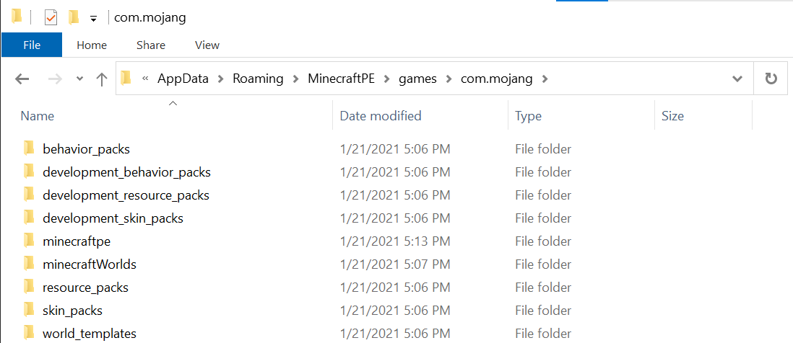

# Getting Started with Add-On Development for Bedrock Edition

Add-Ons are the first step on our journey towards bringing even greater levels of customization to Minecraft: Bedrock Edition. Add-Ons allow players to transform the look of their worlds and even change the behavior of mobs. For example, you can change the blast radius of a creeper and the texture it’s wearing.

:::image type="content" source="Media/GettingStarted/Getting-Started.jpg" alt-text="A creeper mob that has been re-textured to look like TNT":::

In this tutorial, you will learn the following.

>[!div class="checklist"]
>
> - The file structure used by Minecraft Add-Ons.
> - Software used for editing JSON files.
> - Extensions that are available to help with Add-On development.

## com.mojang

When Minecraft is installed on your computer, there is a folder called **com.mojang** that is generated in the AppData folder. You will need to find this folder so you can add your content to it.

To locate the **com.mojang** folder on your computer, you will need to have **Hidden items** checkbox set to **true**, as shown below. while you're at it, go ahead and check the box for **File name extensions**, too.

### Showing hidden items ###

1. Open **File Explorer** from the taskbar.
1. Select the **View** tab.
1. In the **Show/hide** section, select the checkboxes for **File name extensions** and **Hidden items**.

:::image type="content" source="Media/GettingStarted/viewHiddenFolders.png" alt-text="Image of Windows 10 File Explorer window's view options. The File name extensions and Hidden items boxes are checked to indicate that they are set to true":::

### Locating com.mojang

1. Press **Win+R** to open **Run**. 
1. Copy and paste the following into the **Open** field: `%localappdata%\Packages\Microsoft.MinecraftUWP_8wekyb3d8bbwe\LocalState\games\com.mojang`
1. Click **OK**.

>[!TIP]
> Now would be a good time to save a shortcut to this folder on your desktop.

As shown in the image below, there are multiple subdirectories located within the **com.mojang** folder.

> [!TIP]
> If you see more content in this folder than what is shown above, do not panic! This image shows a fresh install of Minecraft.

### Behavior, Skin, and Resource Packs

There are three folders called **behavior_packs**, **resource_packs**, and **skin_packs** that will store finalized custom content that will be added to Minecraft: Bedrock Edition. Don't worry about these folders right now - you are going to be developing content, so you will be working in the development versions of these folders, as discussed in the next section.

### Development Packs

You will use the **development_resource_packs** and **development_behavior_packs** folders for the [Resource Pack](ResourcePack.md) and [Behavior Pack](BehaviorPack.md) tutorials. The **development_skin_packs** folder is used for developing skin packs. Development pack folders are updated each time Minecraft is launched so you can quickly load and test the changes you made to their contents.

### minecraftWorlds

**minecraftWorlds** contains each world that has been generated within the current build of Minecraft. Each folder will also contain resource and behavior pack folders to contain any packs that may be in use within the world.

> [!TIP]
> It's recommended that when installing a new build of Minecraft, you should save a copy of this folder to use as a back up to prevent any potential loss of Minecraft Worlds that you may have.

## Visual Studio Code

JSON is a popular text file format that is used by Minecraft: Bedrock Edition to interact with content. JSON can be edited in any text editor such as Notepad or Word. However, Visual Studio Code is a free to use text-based editor that supports third party extensions, including some built specifically for Bedrock development.

### Installing Visual Studio Code

Follow the link here to [install Visual Studio Code](https://code.visualstudio.com/Download).

## Visual Studio Code Extensions

Visual Studio Code supports extensions created by the Visual Studio Code developer community. Extensions are a great way to help write and understand Minecraft syntax when working on resource and behavior packs.

### Installing Extensions

1. Click on this link to download [Bedrock Definitions](https://marketplace.visualstudio.com/items?itemName=destruc7i0n.vscode-bedrock-definitions) for Visual Studio Code.
1. Click on this link to download [Blockception's Minecraft Bedrock Development](https://marketplace.visualstudio.com/items?itemName=BlockceptionLtd.blockceptionvscodeminecraftbedrockdevelopmentextension) for Visual Studio Code.

## What's Next?

Now that your development environment is set up, you can start creating your first Add-On and learn more about resource packs.

> [!div class="nextstepaction"]
> [Resource Pack](ResourcePack.md)

Alternatively, if you would like to get started with commands in Minecraft, head on over to Introduction to Command Blocks to learn how to use command blocks to chain together different commands.

> [!div class="nextstepaction"]
> [Introduction to Command Blocks](CommandBlocks.md)
