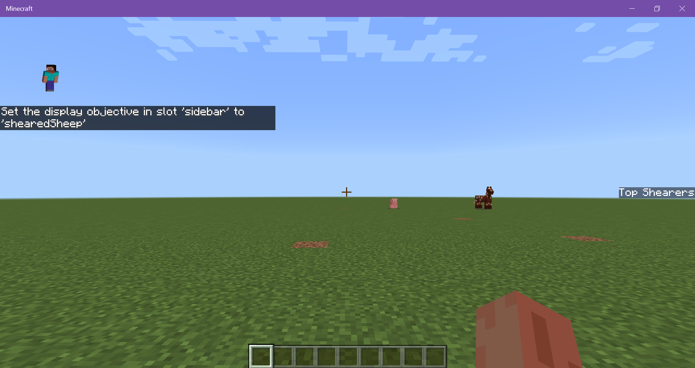
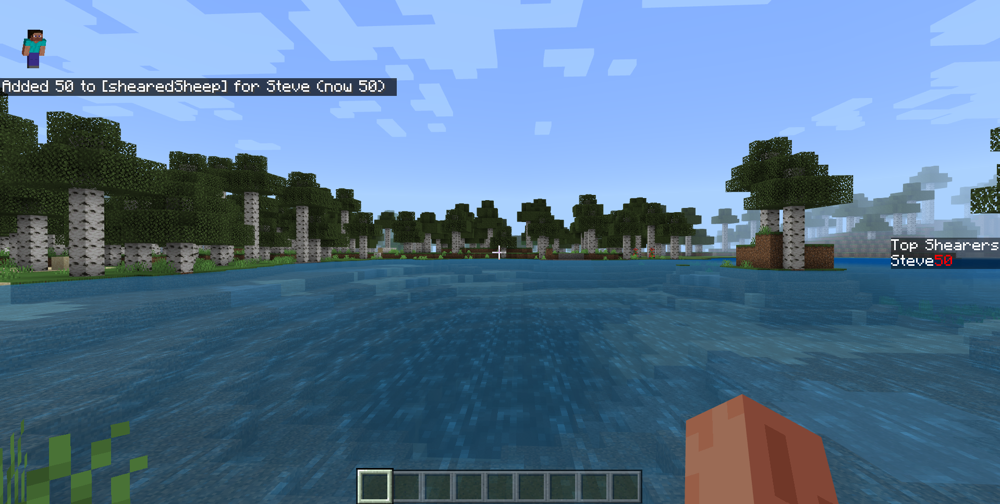
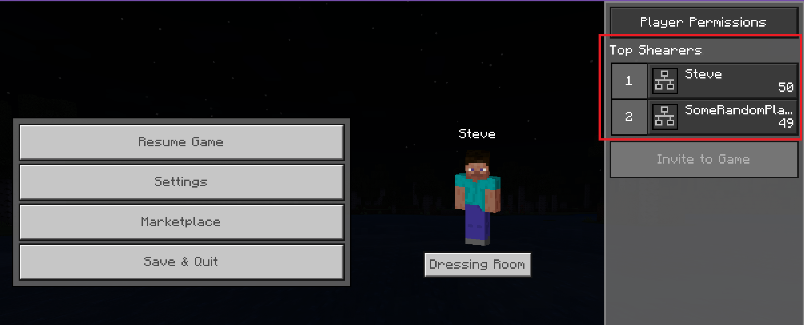

# Introduction to Scoreboards

Scoreboards can store and display information about your world. You can interact with a scoreboard by using commands in the chat, command blocks, functions, or a combination of these things to set up and interact with scoreboards.

In this tutorial you will learn the following:

> [!div class="checklist"]
>
> - The parts of a scoreboard and how to add information to them.
> - The `/scoreboard` command syntax.
> - How to use a scoreboard.

## Parts of a Scoreboard

In this example, to help you learn the parts of a scoreboard and how to change them, you are going to create a basic scoreboard, display it on the screen, and make it show some player names and numbers. Then, you will undo each step to get back to where you started.

1. Start by making a creative mode world and opening the chat.

1. Enter `/scoreboard ` (notice the space after the command) and chat will show you the available scoreboard commands.

    The two main things to notice here are the subcategories for a scoreboard: **objectives** and **players**. An objective is something in the game you want to track, such as how many times a sheep is sheared or a potato is planted. You create objectives and give them an internal name and a name to display on the screen. In this example, we are going to create an objective to track the number of sheep that have been sheared. Then, we will add players and some made-up scores that say how many times each player accomplished the objective.

1. In chat, enter `/scoreboard objectives add shearedSheep dummy "Top Shearers"`. You should get the message "Added new objective 'shearedSheep' successfully."

1. Your objective exists, but we can't see it until we display it on the screen. Enter `/scoreboard objectives setdisplay sidebar shearedSheep`. You should now see a sidebar on the screen with the header Top Shearers.

    

1. Now that our objective exists, add a player named "SomeRandomPlayer" and give them a score of 0. Enter `/scoreboard players add SomeRandomPlayer shearedSheep 0`. The player's name will be displayed on the sidebar under Top Shearers.

1. Add yourself and give yourself a score of 50. Here is one way to do it:
    `/scoreboard players add @s shearedSheep 50`. Your own name will be displayed on the list.

    

## More Scoreboard Commands

To get a list of all of the objectives in the world, enter:
`/scoreboard objectives list`

To get a list of all of the players in a world, enter:
`/scoreboard players list`

To see the same scoreboard information on the pause screen, enter:
`/scoreboard objectives setdisplay list`. You can specify whether the players are ranked in ascending or descending order.

To remove a player from an objective (which removes them from the scoreboard), use:
`/scoreboard players reset <player name> [optional objective name]`

To remove an objective, use:
`/scoreboard objective remove [objective name]`

To set a score for a player in an objective, use:
`/scoreboard players set <player: target> <objective: string> <count: int>`

## What's Next?

Now that you have learned about scoreboards, it's time to create a Complete the Monument challenge.

> [!div class="nextstepaction"]
> [Complete the Monument](CommandsHowToMakeACTMMap.md)
