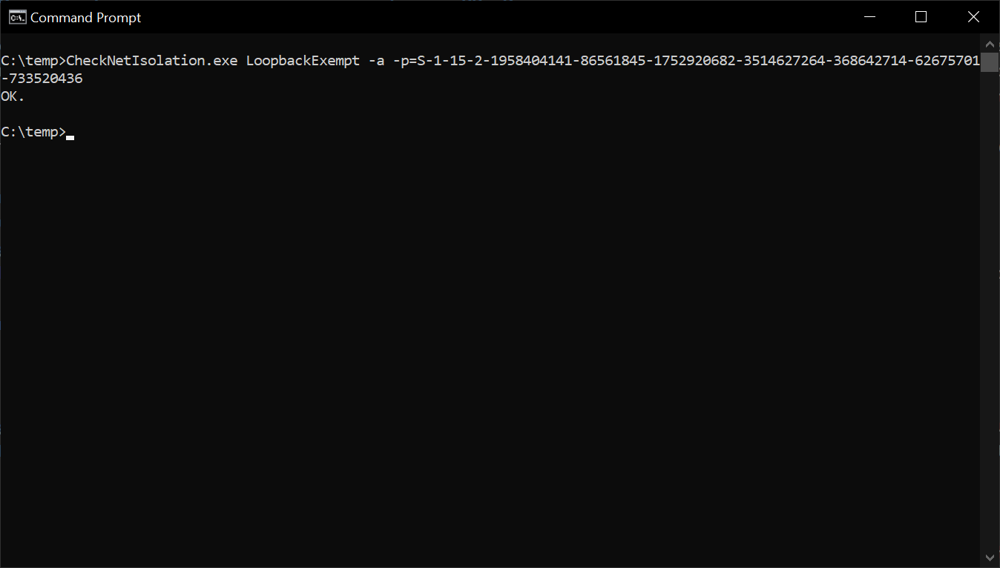
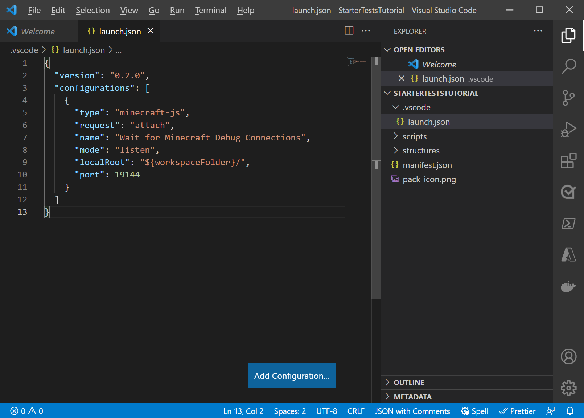
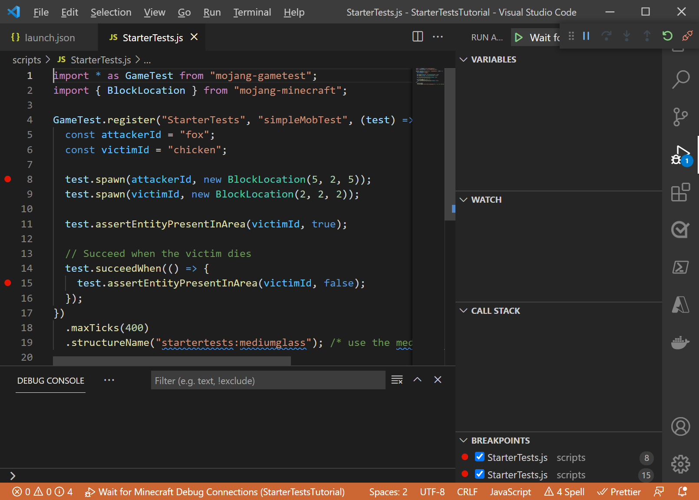
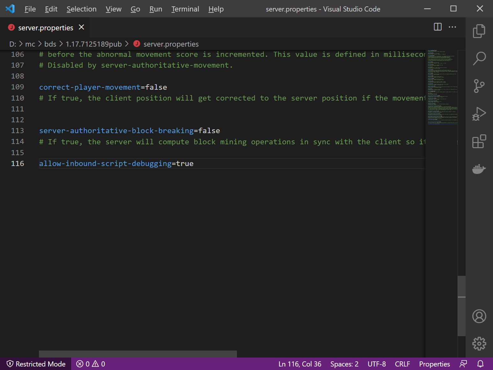

# Use Visual Studio Code tools to write script

Two new tools can make the process of writing your GameTest scripts easier and more fun within Visual Studio Code.

## Custom type definition files for Visual Studio Code Intellisense

Visual Studio Code can display detailed type information for different libraries to provide hints and code-completion dropdowns as you type. Type information has been made available for GameTest modules `mojang-minecraft` and `mojang-gametest`.

To get started, use the Node Package Manager, or npm. npm makes it easy to download and install different modules of code within your packages. Install Node.js – which includes npm - on your development device. More info on installing npm is available from https://nodejs.org. Install the latest LTS version of Node.js to get started.

Once Node.js is installed, getting the latest type definitions is a snap. From Visual Studio Code, open the folder where your behavior pack folder is located and simply run the following commands from a terminal console window:

```powershell
npm i @types/mojang-minecraft
npm i @types/mojang-gametest
```

This will install type definitions in the node_modules folder within your project.

To edit with new code hinting, just open up Visual Studio Code. As you write JavaScript, you should see autocomplete:


and inline reference documentation for types:


>[!Note]
>We are updating these type definitions to match the latest beta APIs, so be sure to check npm often to see if there are updated type definitions.

## Get insight into your code with Minecraft script debugging

As you build more of a codebase in script, you’ll want to inspect your code at various points to see the state of variables and test your algorithms. In many starter projects, people start by using commands like Console.log or Chat to print various variables as they go – informally, this is called "print debugging". But for developers, there is a better way! With scripting within GameTest in Minecraft Bedrock Edition, you can use script debugging capabilities that make inspecting data in Minecraft script a snap.

To get started, you’ll want to use Visual Studio Code as your editor for the JavaScript files you’ve been developing. Steps from there include:

1. Install the Minecraft Bedrock Edition Debugger within Visual Studio Code – you’ll need to do this once
2. Open Visual Studio Code within your development_behavior_packs folder
3. Depending on your testing client - either in Bedrock Dedicated Server or within Minecraft Bedrock clients -- connect Minecraft Bedrock Edition and Visual Studio Code
4. Set break points and add watch variables in your code as you go, and then connect Minecraft to Visual Studio Code

>[!IMPORTANT]
>The Minecraft debugger and GameTest Framework experiment are optimized to work with the latest Beta versions of Minecraft. See [Minecraft Betas](https://aka.ms/mcbeta) for more information.

### Debugging with Minecraft Bedrock Edition

#### Step 1: Install the Minecraft Bedrock Edition Debugger within Visual Studio Code

To use debugger capabilities, you’ll want to install the Minecraft Bedrock Edition Debugger within Visual Studio Code. To do this, please click on the button below to download the **Minecraft Bedrock Edition Debugger** from Visual Studio Code's marketplace.

> [!div class="nextstepaction"]
> [Minecraft Bedrock Edition Debugger](https://aka.ms/vscodescriptdebugger)

#### Step 2: Ensure that the Minecraft Bedrock Edition client can make "loopback" requests

If you want to connect Minecraft Bedrock Edition client to Visual Studio Code running on the same machine (this is the most common scenario), you will need to exempt the Minecraft client from UWP loopback restrictions. To do this, run the following from a command prompt or the Start | Run app.

```powershell
CheckNetIsolation.exe LoopbackExempt -a -p=S-1-15-2-1958404141-86561845-1752920682-3514627264-368642714-62675701-733520436
```



#### Step 3: Open Visual Studio Code within your development_behavior_packs folder

In order for the debugger to know where to find your source JavaScript files, you’ll need to specifically open up a window of Visual Studio Code relative to the behavior pack where your JavaScript source files are.

While you’re building out gametests, you will most likely deploy them to Minecraft’s development_behavior_packs folder. This is located within `%localappdata%\Packages\Microsoft.MinecraftUWP_8wekyb3d8bbwe\LocalState\games\com.mojang\development_behavior_packs`. Select the behavior pack you’d like to debug, and open up a Visual Studio Code window pointed at that folder.

#### Step 4: Prepare Visual Studio Code for a connection

To debug with Minecraft Bedrock Edition, you’ll need to connect from Minecraft and into Visual Studio Code. This sample assumes you are debugging on the same Windows 10 machine, but you can also debug across machines and across clients if you want to. If you are debugging across devices, you may need to open up a port within your firewall on the machine that you are running Visual Studio Code within.

To configure the connection, add a .vscode subfolder to your behavior pack folder.  Within that .vscode folder, add the following launch.json configuration file:

(NOTE: you do not need to edit any lines of this file.)

```json
{
  "version": "0.2.0",
  "configurations": [
    {
      "type": "minecraft-js",
      "request": "attach",
      "name": "Wait for Minecraft Debug Connections",
      "mode": "listen",
      "localRoot": "${workspaceFolder}/",
      "port": 19144
    }
  ]
}
```



#### Step 5. Run your Minecraft Behavior Pack

Now that you’ve prepared Visual Studio Code and prepared your Behavior Pack, you’re ready to start debugging!

First, click **Start Debugging** inside of Visual Studio Code. This will put Visual Studio Code into *listen for a debugging connection* mode.

Start Minecraft and load into a world with your scripting behavior pack. You may want to set a break point inside of your GameTest function. To do this, click to the left of the specific lines of code where you want to set your break point.



Use this slash command to connect to Visual Studio Code on a port.

`/script debugger connect localhost 19144`

You should see connection success response from slash command.

Now, trigger the code (likely by running a test, for example `/gametest run (my test name)`)

You should see your breakpoints get hit. You can also view local variables and add watches as necessary.


### Debugging with Minecraft Bedrock Dedicated Server

The procedure for debugging with Bedrock Dedicated Server is a little different. When debugging with Bedrock Dedicated Server, Bedrock Dedicated Server will listen for debug connections initiated from Visual Studio Code. You’ll want to start by installing the Minecraft Bedrock Edition Debugger for Visual Studio Code as described above.

#### Configure your Bedrock Dedicated Server

By default, Bedrock Dedicated Servers are not configured to allow debug connections. To enable this debugging, you'll need to change some settings within the `server.properties` file of your Bedrock Dedicated Server.

These settings configure debugging on Bedrock Dedicated Server:

 * `allow-outbound-script-debugging` (true/false) - enables the /script debugger connect command. Defaults to false.
 * `allow-inbound-script-debugging` (true false) - enables the /script debugger listen command (and the opening of ports on a server).  Defaults to false.
 * `force-inbound-debug-port` (number) - Locks the inbound debug port to a particular port. This will set the default script debugging port and prevent a user of the /script debugger listen command from specifying an alternate port.

For this project, we can simply set allow-inbound-script-debugging to true.



#### Prepare your Behavior Pack Project

Your Visual Studio Code instance should be pointing at the root of your Behavior Pack within the development_behavior_packs folder of the Minecraft instance (so you should open Visual Studio code at `(my Bedrock Dedicated Server installation)\development_behavior_packs\(behaviorpackname)`)

At the root of the behavior pack you want to debug, add a .vscode subfolder. Add the following launch.json file into that .vscode folder:
(NOTE: you do not need to edit any lines of this file.)

```json
{
  "version": "0.2.0",
  "configurations": [
    {
      "type": "minecraft-js",
      "request": "attach",
      "name": "Attach to Minecraft Bedrock Dedicated Server",
      "localRoot": "${workspaceFolder}/",
      "port": 19144
    }
  ]
}
```

#### Run your Minecraft Behavior Pack

Now that you’ve prepared Visual Studio Code and prepared your behavior pack, you’re ready to start debugging!

Start Minecraft and load into a world with your scripting behavior pack.

Within Bedrock Dedicated Server's console, use this slash command to start listening on a port:

`script debugger listen 19144`

You should see a "Debugger listening" response from this command.


Now, hit "Start Debugging" inside of Visual Studio Code.

You can run commands in Bedrock Dedicated Server to initiate tests, such as `/gametest run (my test name)`.

You can set breakpoints in your code by clicking on the left-hand side of the editor, on specific lines of code. As you run the tests in the behavior pack, your breakpoints should be hit. You can also view local variables and add watches as necessary.

That's it! Between updated code helpers as you add lines of JavaScript, and new debugger capabilities within Visual Studio Code, we hope you'll be able to write more extensive tests and script much more quickly.
