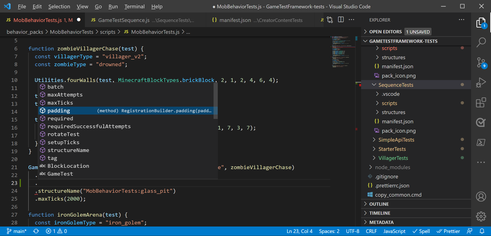
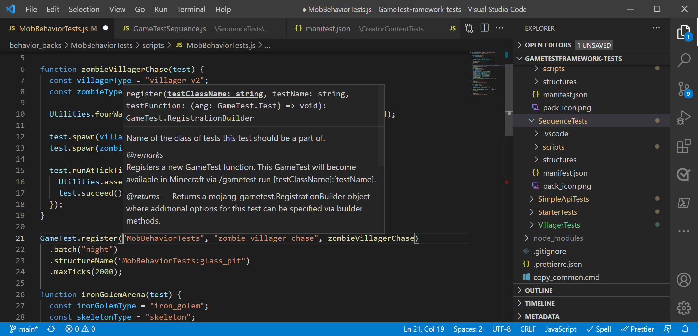
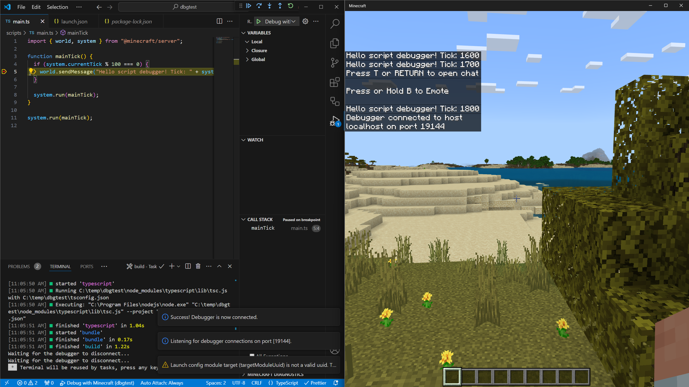
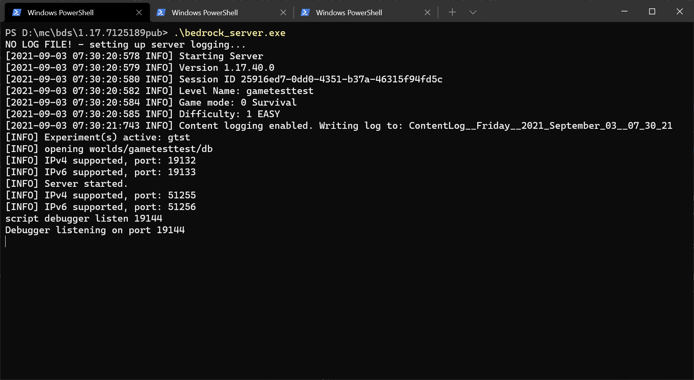
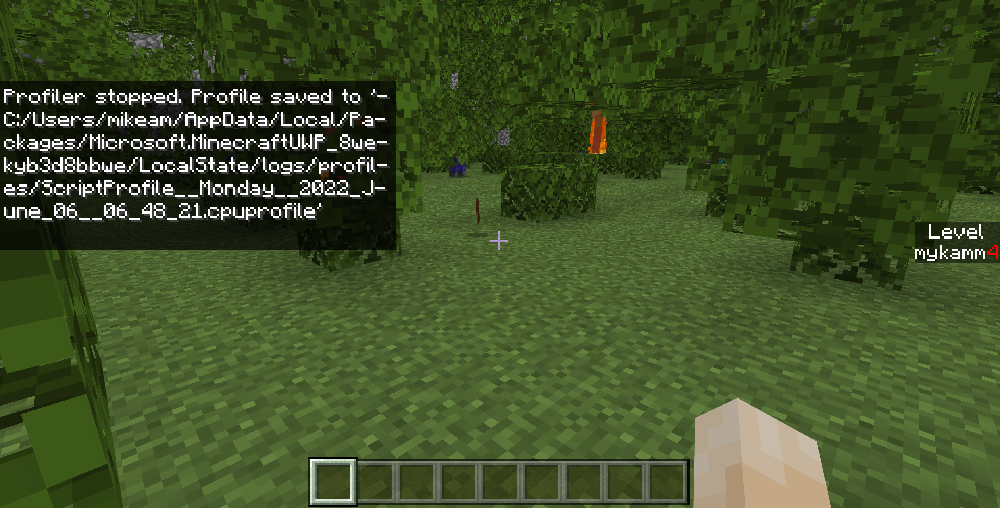
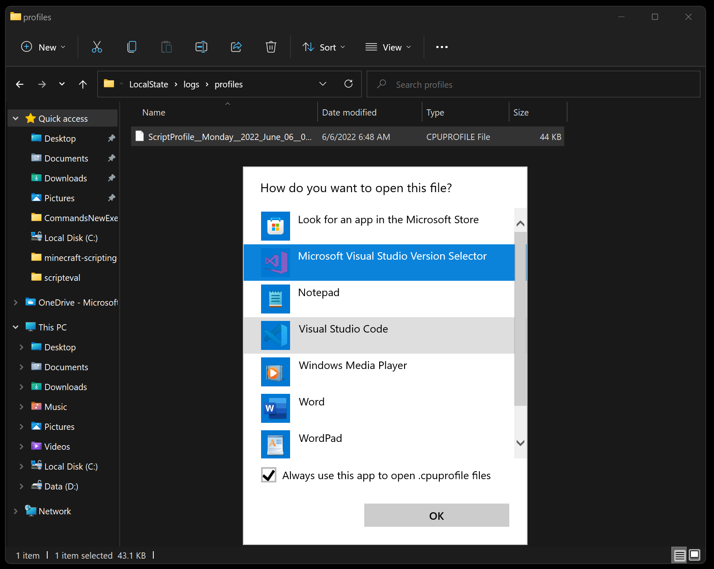

# Use Visual Studio Code tools to write script

There are a few tools that can make the process of writing your JavaScript easier and more fun within Visual Studio Code. In this article, we'll discuss how you can install custom type definitions for Minecraft to provide autocomplete as you work, the Minecraft Script Debugger, and the Minecraft Script Profiler. A big note: in the GitHub repository at [https://github.com/microsoft/minecraft-scripting-samples](https://github.com/microsoft/minecraft-scripting-samples), there are various starter samples and examples that come with these tools pre-configured, so if you start your project using those, a lot of the configuration work is already done for you.  

## Custom type definition files for Visual Studio Code Intellisense

Visual Studio Code can display detailed type information for different libraries to provide hints and code-completion dropdowns as you type. Type information has been made available for scripting modules `@minecraft/server`,`@minecraft/server-ui`, and several beta modules such as `@minecraft/server-gametest`.

To get started, use the Node Package Manager, or npm. npm makes it easy to download and install different modules of code within your packages. Install Node.js – which includes npm - on your development device. More info on installing npm is available from [nodejs.org](https://nodejs.org). Install the latest LTS version of Node.js to get started.

Once Node.js is installed, getting the latest type definitions is a snap. From Visual Studio Code, open the folder where your behavior pack folder is located and simply run the following commands from a terminal console window:

```powershell
npm i @minecraft/server
npm i @minecraft/server-gametest
```

This will install type definitions in the node_modules folder within your project.

To edit with new code hinting, just open up Visual Studio Code. As you write JavaScript, you should see autocomplete:



and inline reference documentation for types:



>[!Note]

> We are updating these type definitions to match the latest APIs, so be sure to check npm often to see if there are updated type definitions.

If you wish to access the latest beta API versions of modules, you can use the @beta version signifier, as follows:

```powershell
npm i @minecraft/server@beta
npm i @minecraft/server-ui@beta
```

## Get insight into your code with Minecraft script debugging

As you build more of a codebase in script, you'll want to inspect your code at various points to see the state of variables and test your algorithms. In many starter projects, people start by using commands like Console.log or Chat to print various variables as they go – informally, this is called "print debugging". But for developers, there is a better way! With scripting in Minecraft Bedrock Edition, you can use script debugging capabilities that make inspecting data in Minecraft script a snap.

To get started, you'll want to use Visual Studio Code as your editor for the JavaScript files you've been developing. Steps from there include:

1. Install the Minecraft Bedrock Edition Debugger within Visual Studio Code – you'll need to do this once
1. Open Visual Studio Code within your development_behavior_packs folder
1. Depending on your testing client - either in Bedrock Dedicated Server or within Minecraft Bedrock clients -- connect Minecraft Bedrock Edition and Visual Studio Code
1. Set break points and add watch variables in your code as you go, and then connect Minecraft to Visual Studio Code

### Debugging with Minecraft Bedrock Edition

#### Step 1: Install the Minecraft Bedrock Edition Debugger within Visual Studio Code

To use debugger capabilities, you'll want to install the Minecraft Bedrock Edition Debugger within Visual Studio Code. To do this, please click on the button below to download the **Minecraft Bedrock Edition Debugger** from Visual Studio Code's marketplace.

> [!div class="nextstepaction"]
> [Minecraft Bedrock Edition Debugger](https://aka.ms/vscodescriptdebugger)

#### Step 2: Ensure that the Minecraft Bedrock Edition client can make "loopback" requests

If you want to connect Minecraft Bedrock Edition client to Visual Studio Code running on the same machine (this is the most common scenario), you will need to exempt the Minecraft client from UWP loopback restrictions. To do this, run the following from a command prompt or the Start | Run app.

Minecraft Bedrock Edition:

```powershell
CheckNetIsolation.exe LoopbackExempt -a -p=S-1-15-2-1958404141-86561845-1752920682-3514627264-368642714-62675701-733520436
```

Minecraft Bedrock Edition Preview:

```powershell
CheckNetIsolation.exe LoopbackExempt -a -p=S-1-15-2-424268864-5579737-879501358-346833251-474568803-887069379-4040235476
```


#### Step 3: Open Visual Studio Code within your development_behavior_packs folder

In order for the debugger to know where to find your source JavaScript or TypeScript files, you'll need to specifically open up a window of Visual Studio Code relative to the behavior pack where your JavaScript or TypeScript source files are. This may be inside of Minecraft's development_behavior_packs folder (e.g., `localappdata%\Packages\Microsoft.MinecraftUWP_8wekyb3d8bbwe\LocalState\games\com.mojang\development_behavior_packs`) - or you may have your source code located in a separate folder (e.g., `c:\projects\myaddon`).

Open up a Visual Studio Code window pointed at the folder with your add-on script source.

#### Step 4: Prepare Visual Studio Code for a connection

To debug with Minecraft Bedrock Edition, you'll need to connect from Minecraft and into Visual Studio Code. This set of steps assumes you are debugging on the same Windows machine that you are running Minecraft from, but you can also debug across machines and across clients if you want to. If you are debugging across devices, you may need to open up a port within your firewall on the machine that you are running Visual Studio Code within.

You'll want to configure Visual Studio Code to know how to connect to Minecraft. If you're using a sample project such as the TS starter [minecraft-scripting-samples/ts-starter](https://github.com/microsoft/minecraft-scripting-samples/tree/main/ts-starter), this .vscode/launch.json file is already configured for you. But if you're creating a project from scratch, follow these instructions:

At the root of the behavior pack you want to debug, add a `.vscode` subfolder. Add the following launch.json file into that `.vscode` folder.

If your source is in JavaScript and you are developing directly against that source (you do not use a script build process), you'll want to configure `launch.json` as follows:

```json
{
  "version": "0.3.0",
  "configurations": [
    {
      "type": "minecraft-js",
      "request": "attach",
      "name": "Debug with Minecraft",
      "mode": "connect",
      "preLaunchTask": "build",
      "targetModuleUuid": "7c7e693f-99f4-41a9-95e0-1f57b37e1e12",
      "localRoot": "${workspaceFolder}/",
      "port": 19144
   }
  ]
}
```

`localRoot` should point at the folder which contains your behavior pack with script within it.
Port 19144 is the default networking port for Minecraft Script Debugging.

In the example above, `targetModuleUuid` is an optional parameter that specifies the identifier of your script module, which is located in your behavior pack's `manifest.json` file. This is important to use if you are developing add-ons in Minecraft while there are multiple behavior packs with script active.

If your source is in a language like TypeScript that generates JavaScript for Minecraft, you will want to use `sourceMapRoot` and `generatedSourceRoot` parameters in `launch.json`:

```json
{
  "version": "0.3.0",
  "configurations": [
    {
      "type": "minecraft-js",
      "request": "attach",
      "name": "Debug with Minecraft",
      "mode": "connect",
      "preLaunchTask": "build",
      "targetModuleUuid": "7c7e693f-99f4-41a9-95e0-1f57b37e1e12",
      "sourceMapRoot": "${workspaceFolder}/dist/debug/",
      "generatedSourceRoot": "${workspaceFolder}/dist/scripts/",
      "port": 19144
   }
  ]
}
```

Note that `generatedSourceRoot` should point at a folder where your generated JavaScript files (*.js) are stored - for example, the outputs of a TypeScript build process. `sourceMapRoot` should point at a folder where you have source map files - typically created during your build process - that tie your generated JavaScript source files back to your potential TypeScript source.

#### Run your Minecraft Behavior Pack

Now that you've prepared Visual Studio Code and prepared your behavior pack, you're ready to start debugging!

Within Visual Studio Code, click the "Debug with Minecraft" option under the Run menu (or hit F5) to start debugging. This will place Visual Studio Code into "Listen Mode", where it awaits a connection from Minecraft.

Start Minecraft and load into a world with your scripting behavior pack.

Use this slash command to connect Minecraft to Visual Studio Code:

`script debugger connect`

You should see a "Debugger connected to host" response from this command if the connection is successful.



You can set breakpoints in your code by clicking on the left-hand side of the editor, on specific lines of code. As you run the tests in the behavior pack, your breakpoints should be hit. You can also view local variables and add watches as necessary.

### Debugging with Minecraft Bedrock Dedicated Server

The procedure for debugging with Bedrock Dedicated Server is a little different. When debugging with Bedrock Dedicated Server, Bedrock Dedicated Server (not Visual Studio Code) will listen for debug connections initiated from Visual Studio Code. You'll want to start by installing the Minecraft Bedrock Edition Debugger for Visual Studio Code as described above.

#### Configure your Bedrock Dedicated Server

By default, Bedrock Dedicated Servers are not configured to allow debug connections. To enable this debugging, you'll need to change some settings within the `server.properties` file of your Bedrock Dedicated Server.

These settings configure debugging on Bedrock Dedicated Server:

- `allow-outbound-script-debugging` (true/false): enables the /script debugger connect command. Defaults to false.
- `allow-inbound-script-debugging` (true false): enables the /script debugger listen command (and the opening of ports on a server).  Defaults to false.
- `force-inbound-debug-port` (number): Locks the inbound debug port to a particular port. This will set the default script debugging port and prevent a user of the /script debugger listen command from specifying an alternate port.


Within Bedrock Dedicated Server's console, use this slash command to start listening on a port:

`script debugger listen 19144`

You should see a "Debugger listening" response from this command.



Within Visual Studio Code, you'll want to configure your debug settings in `launch.json` to have Visual Studio connect to Dedicated Server. To do this, set "mode" to "connect".

```json
{
    "version": "0.3.0",
    "configurations": [
      {
        "type": "minecraft-js",
        "request": "attach",
        "name": "Debug with Minecraft",
        "mode": "connect",
        "preLaunchTask": "build",
        "sourceMapRoot": "${workspaceFolder}/dist/debug/",
        "generatedSourceRoot": "${workspaceFolder}/dist/scripts/",
        "port": 19144
      }
    ]
  }
```

Now, hit "Start Debugging" inside of Visual Studio Code.

As with when you debug against Minecraft clients, you can set breakpoints in your code by clicking on the left-hand side of the editor, on specific lines of code.

### Using the Minecraft Scripting Profiler

A profiler is a set of monitoring code that measures the amount of time spent running various functions. With it, you can identify where most of your time is spent within your scripts. This may then lead you to discovering unexpected function calling patterns that may consume a lot of time.

#### Run the profiler during a typical session for your script

To get started, ensure you have a behavior pack with JavaScript within it. Your first step is to create a profile session, or in other words, log the performance characteristics of your script as you play through the game.

To run the script profiler and start a new profile session, run the following command:

``` 
/script profiler start
```

Then, exercise your code by running through and playing Minecraft. You'll want to go through normal gameplay or testing patterns to have your JavaScript exercised in representative ways of how players might encounter your experience.

After a while – many minutes, perhaps, end your profiler session by running the following command:

```
/script profiler stop
```

This will create a .cpuprofile with a timestamp within your Minecraft log folder.




If you are using the retail version of Minecraft, the log folder is located at:

`%localappdata%\Packages\Microsoft.MinecraftUWP_8wekyb3d8bbwe\LocalState\logs\`

If you are using Minecraft Preview, that log folder is located at:

`%localappdata%\Packages\Microsoft.MinecraftWindowsBeta_8wekyb3d8bbwe\LocalState\logs`

To view a CPUProfile, simply open it within Visual Studio Code. The first time you open a CPUProfile file, your operating system will ask you how you wish to open the file. Select Open in [Visual Studio Code](https://code.visualstudio.com):



(Note that if you wish to have source links from the profile resolve to your source files correctly, start Visual Studio Code (or set its working directory) within the root of your behavior pack.)

By default, this will give you a simple visual listing of the functions that were called during your CPU Profile session, and the cumulative time that they have taken:


As a developer, you can start to optimize your code to adjust for performance - in this case, perhaps organizing code to share instances of a dimension object rather than repeatedly calling world.getDimension.

Note that within Visual Studio Code, you can install an optional "Flame Chart" plugin by clicking the little flame icon in the upper right of your screen (circled in red, below):


Note: In versions 1.19.10 and beyond, the script profiler has been expanded to support coverage of core Bedrock API calls in addition to overall function calls.

With this profiler capability, you can quickly identify hotspots and where server time is spent, and spend your time optimizing your code where it matters.

### Summary

That's it! Between updated code helpers as you add lines of JavaScript, debugger capabilities within Visual Studio Code, and profiler support we hope you'll be able to write more extensive tests and script much more quickly.
