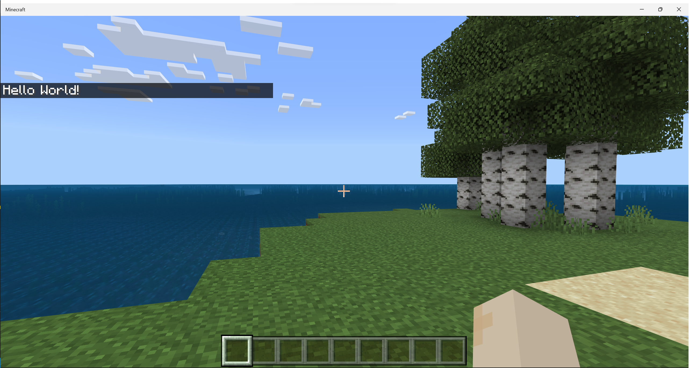
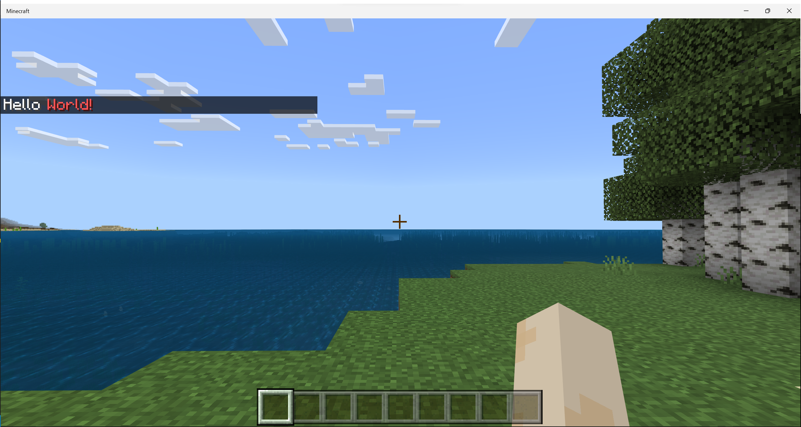
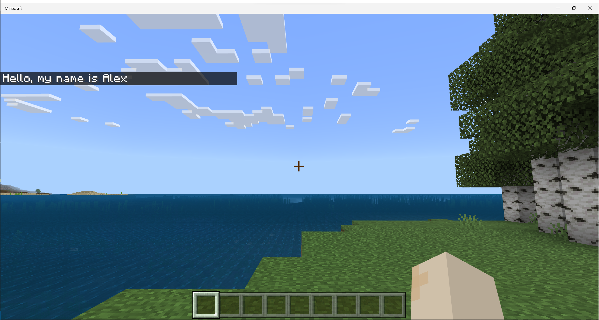
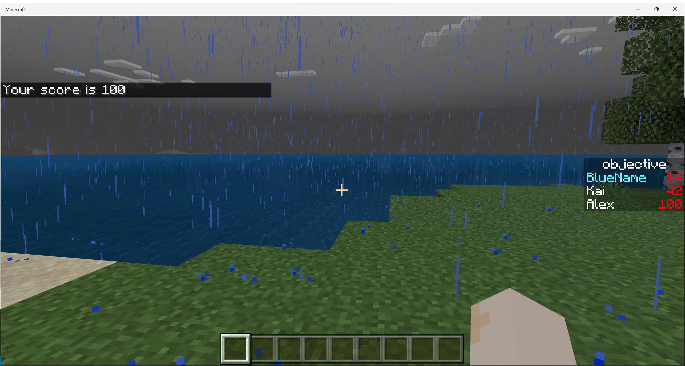
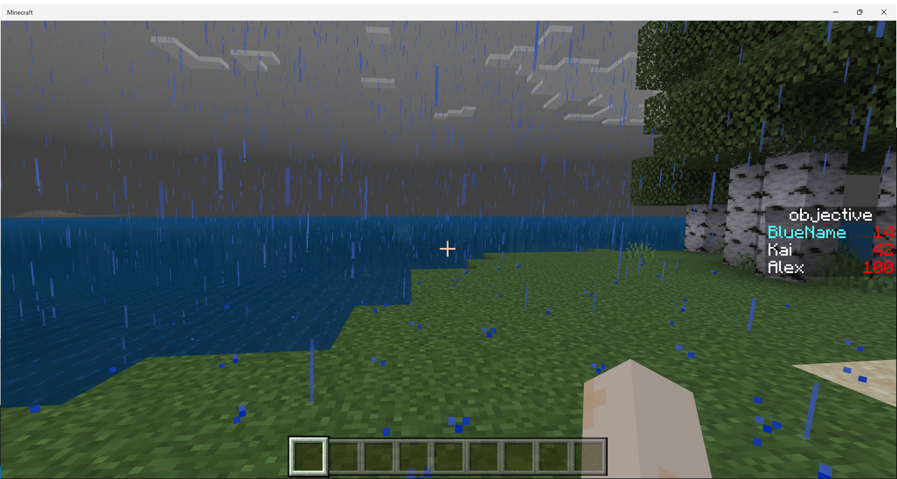

# Raw Message JSON

Raw message JSON is used to customize the look of text. With raw JSON code, you can change the appearance of text in places like chat messages (`tellraw`), titles (`titleraw`), books, signs, item names, entity names, world names, scoreboard displays, and text that is displayed through script APIs.

## Rawtext

This is a simple raw text message:

`{"rawtext":[{"text":"Hello World"}]}`

The combination of square and curly brackets makes more sense with the JSON code indented like this:

```json
{
  "rawtext":
   [
    {
    "text":"Hello, World!"
    }
   ]
}
```

With it formatted this way, you can see how `{"text":"..."}` is a content tag or "node". Other content tags include `translate`, `with`, `score`, and `scoreboard`, which will be covered later.

In Minecraft, all raw text is entered on one line. This is how to put that message into the `/tellraw` command using the "all players" selector:

`/tellraw @a {"rawtext":[{"text":"Hello World"}]}`



## Text

In Bedrock Edition, you can change the formatting of text by placing a `§` symbol (sometimes called a "section symbol" or "silcrow") along with the formatting code directly before the text you want to format. Instead of the section symbol code, you can use the unicode escape sequence (also known as MOTD code).

For example, placing `§c` or `\u00A7c` will color the text that comes after it red.

If you want to use the section symbol, some possible ways to enter it with a keyboard are to hold the `alt` key and enter `21` or `0167` using the numpad keys on your keyboard.

Perhaps easiest way to get the symbol is to copy and paste it from another page, like this one:

```json
§
```

This is a text node that will display Hello World! with the word "World!" in red:

`{"text":"Hello §cWorld!"}`

Here is how that same line goes into the rawtext code segment:

`{"rawtext":[{"text":"Hello §cWorld!"}]}`

And this is how it would fit into the tellraw command, using the "all players" selector:

`/tellraw @a {"rawtext":[{"text":"Hello §cWorld!"}]}`



If you want to reset the formatting, use `§r`.
This will remove the red formatting from the exclamation point:

`{"rawtext":[{"text":"Hello §cWorld§r!"}]}`


### Formatting Codes §

|Format code |Unicode escape sequence |Color or Effect |
|:----------:|-----------|-----------|
|`§0`|`\u00a70`|black|
|`§1`|`\u00a71`|dark blue|
|`§2`|`\u00a72`|dark green|
|`§3`|`\u00a73`|dark aqua|
|`§4`|`\u00a74`|dark red|
|`§5`|`\u00a75`|dark purple|
|`§6`|`\u00a76`|orange|
|`§7`|`\u00a77`|gray|
|`§8`|`\u00a78`|dark gray|
|`§9`|`\u00a79`|blue|
|`§a`|`\u00a7a`|green|
|`§b`|`\u00a7b`|light blue|
|`§c`|`\u00a7c`|red|
|`§d`|`\u00a7d`|pink|
|`§e`|`\u00a7e`|yellow|
|`§f`|`\u00a7f`|white|
|`§g`|`\u00a7g`|gold|
|`§h`|`\u00a7h`|warm light gray|
|`§i`|`\u00a7i`|cool light gray|
|`§j`|`\u00a7j`|dark brown|
|`§k`|`\u00a7k`|obfuscated text|
|`§l`|`\u00a7l`|**bold**|
|`§m`|`\u00a7m`|dark red|
|`§n`|`\u00a7n`|brown|
|`§o`|`\u00a7o`|*italic*|
|`§p`|`\u00a7p`|gold|
|`§q`|`\u00a7q`|dark green|
|`§r`|`\u00a7r`|reset|
|`§s`|`\u00a7s`|aqua|
|`§t`|`\u00a7t`|dark teal|
|`§u`|`\u00a7u`|purple|
|`§v`|`\u00a7v`|no effect|
|`§w`|`\u00a7w`|no effect|
|`§x`|`\u00a7x`|no effect|
|`§y`|`\u00a7y`|no effect|
|`§z`|`\u00a7z`|no effect|

### Commonly Used Escape Characters

|Format code |Unicode escape sequence |Color or Effect |
|:----------:|-----------|-----------|
|`\n`|`\u000a`|new line|
|`\"`|`\u0022`|double quote|
|`\'`|`\u0027`|single quote|

## Translate

`translate` content tags are used to look up translated text in the player's designated language using text keys, just like how it's done in lang files from resource packs or other assets.

Example:

`"{\"rawtext\":[ {\"translate\":\"custom.book.page.1\"}]}",`
`"{\"rawtext\":[ {\"translate\":\"custom.book.page.2\"}]}"`

### With

Translations can contain slots for text that is not known ahead of time, such as player names. These slots are defined in the translation text itself, not in the JSON text component, and generally take the form `%%1` to designate the index of the value being substituted.

`%%1`displays the first argument. `%%2` would be the second.

If no argument is provided for a slot, the slot is not displayed.

This string `chat.type.announcement=[%s] %s` needs two more strings to fill in the `%s` parts - with can be followed by an array or a rawtext object.

Example 1: `"rawtext":[{"translate": "chat.type.announcement", "with": [ "value1", "value2" ]}]`
Example 2: `"rawtext":[{"translate": "chat.type.announcement", "with":{"rawtext":[{"text": "value1"}, {"text": "value2"}]}}]`

## Selector

You can use a selector node,`{"selector": ...}`, to insert a name that has been selected , `"@s"`, into your raw text message.

`/tellraw @a {"rawtext": [{"text": "Hello, my name is "}, {"selector": "@s"}]}`

Here is that same command, reformatted for clarity:

```json
{
  "rawtext":
   [
    {
      "text": "Hello, my name is "
    },
    {
      "selector": "@s"
    }
   ]
}
```



`selector` can also display the entity names found with the selector:

`"rawtext":[{"selector": "@e"}]`

## Score

`score` will display a value from the scoreboard:

`"rawtext":[{"score": {"name": "my_name", "objective": "my_objective"}}]`

Example:

`/tellraw @s {"rawtext": [{"text": "Your score is "}, {"score":{"name": "@s","objective": "objective_name"}}]}`



You can find more information about scoreboards in the [Scoreboard Introduction](../../documents/scoreboardintroduction.md).

### Scoreboard objective player name color

If you want to change the color of a player name, when you add their name to the scoreboard objective, put a formatting code like this:

`/scoreboard players add §bBlueName objective 7`


