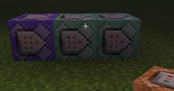
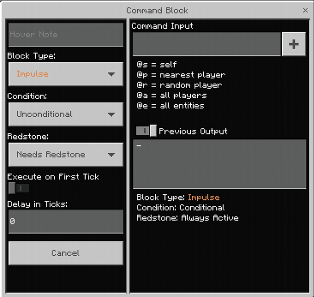

# Getting Started with Command Blocks

Command Blocks are a specialized type of block within a Minecraft world that allows the use of console commands in game. Command Blocks are able to extend and build completely new experiences for players to experience.

In this tutorial, you will learn the following;

> [!div class="checklist"]
>
> - What are Command Blocks and how to access them in-game.
> - How /cheats can be used via Command Blocks.
> - How Command Block chains work by stringing together multiple Command Blocks.
> - Create a Gameplay loop to reward a player after performing an action.

In this guide, we will set up a Command Block chain to look for a certain type of block in a set location, and then reward the player for placing a block in the correct place.

### Requirements

- A Minecraft world with cheats enabled.

#### Setting the map up

While this can be done on any Minecraft world that a player may have, we will be using a flat world in order to take advantage of using lower values for the coordinates.

1. Launch Minecraft.
1. Select **Play**, select **Create New**, then select **Create New World**.
1. In the world settings, set the world to **Flat World**.
1. In the world settings, set **Show Coordinates** to **True**.
1. In the world settings, set **Enabled Cheats** to **True**.
1. Select **Create**.

### How to get Command Blocks

Since Command Blocks are not a craft-able Block, they will need to be added via the Command Console.

1. Open up the chat dialogue box (T or Enter on Windows 10 OS).
1. Type the following command: `/give @s command_block`

You will see a single Command Block that has been added to your inventory.

<insert photo of inventory>

## How to use Command Blocks

Command Blocks have a wide range of uses within Minecraft, from handling entity spawning locations, rewarding a player for an action, or used to keep score in a multiplayer experience. Command Blocks also have a lot of customization settings to fit your needs.

When placing a block, you may notice arrows on the side.

These arrows will always point towards the player when placing down. The arrows show the flow of execution, as shown in the image as the block on the left will execute first, followed by the middle Command Block and finally the last block on the right will execute.

Click the **Use** button (right-click for Windows 10 OS), to open up the Command Block GUI.

## Command Block GUI

- **Block Type** defines what type of Command Block this is. There are 3 options:
    - **Impulse** will execute once they are activated via redstone signal.
    - **Chain** will execute every time that they are triggered by the previous block in the chain.
    - **Repeat** will execute their command once every in-game tick.
        - By default, **Minecraft ticks are 20 ticks per second**.
-	**Condition** defines when a Command Block will execute it’s action. There are 2 options:
    - **Conditional** will only execute if the previous block in a chain was successful
    - **Unconditional** will execute regardless if the previous block was successful or not.
- **Redstone** defines whether or not a Command Block requires redstone to activate. There are 2 options:
    - **Needs Redstone** will set the Command Block to require redstone activation source.
    - **Always Active** will set the Command Block to always activate with or without redstone.
- **Execute on First Tick** is a boolean (True/False statement) that is used for Command Blocks set to repeat. If set **True**, the command will activate as soon as it is activated. If set **False**, the command will activate on a delay.
- **Delay in Ticks** is a value that defines how long a command waits to execute after the Command Block has been activated.

## Designing a Gameplay Loop

A use case of Command Blocks is allowing creators to create gameplay loops within Minecraft to enrich the player's experience. A simple gameplay loop would be rewarding a player for completing an action. If the gameplay loop was to give a player an emerald for placing a block of wool in a certain location, you can break down each step needed:

1. Check to see if a wool block exists at a set location.
1. Once a player places a block in the desired location, check to see if the player has already received the reward by checking their score.
1. If the player hasn't receive the reward, give the player an emerald.
1. If the player received a emerald, then give them a point.

### Scoreboard

The Scoreboard is a gameplay system that exists within Minecraft that can keep track of players, objectives, and score values. The scoreboard enables c a wide use of options to create unique gameplay styles. In this tutorial, you will have a single objective and value in order to track when a player has completed the task.

1. In Minecraft, Open up the chat dialogue box (T or Enter on Windows 10 OS)
1. Enter the following command: `/scoreboard objectives add wool_placed dummy`.
    1. The command is adding a brand new objective called Wool_Placed. Dummy fills the argument since scores can only be adjusted via commands.
1. Enter the following command: `/scoreboard players set @p wool_placed 0`.

### Setting up the first Command Block

Now that we have looked at the settings of a Command Block, let’s set up the first block to detect a certain type of block in a location.

1. Place a Command Block on the ground in a location near your player character.
1. Right-click to open up the Command Block GUI.
1. Set the **Block Type** to **Repeat**.
1. Set the **Condition** to **Unconditional**.
1. Set the **Redstone** to **Always Active**.

#### The /testforblock Command

The /testforblock command will look for a specific block at a specific point that the creator can specify. In the example of `/testforblock 0 0 0 wool`, you can see that the command is looking for any type of wool block located at 0, 0, 0.

`/testforblock <position: x y z> <tileName:block> [dataValue: int]`

- **Position** is the coordinates in the world where the Command Block will look for the specific block.
- **TileName** is the type of block you are looking for. This must be the Bedrock Block ID of the block.
- **DataValue** is an extra argument used to handle variations of the same block. For instance, wool has many different colors. If you set it to `wool` or `wool -1`, it will look for all types of wool. If you set it to `wool 1`, it will only look for orange wool.

If you are following this tutorial, you will be in a flat world. The flat world has no blocks placed above the height, or y, value of 4. Let’s set the command input to look for any type of wool block near the origin of the map.

1. In the Command Input section, input the following: `/testforblock 0 4 0 wool -1`
1. Close the GUI.

## Command Block Chains

Command Blocks have multiple types it can be set to. A Command Block set to a Chain type means that it will execute its' command if the previous Command Block executed. You can connect multiple types of Command Blocks and chain them together to execute a series of logic. The next step in the gameplay loop is to check if the player is able to receive a reward.

1. Place another Command Block next to the existing block. Make sure that the new block is placed in front of the direction that the arrow is pointing.
1. Click the **Use** button on the newly created block to open the Command Block GUI.
1. Set the **Block Type** to **Chain**.
1. Set the **Condition** to **Conditional**.
1. Set the **Redstone** to **Always Active**.
1. Set the **Command Input** to  `/scoreboard players test @p wool_placed 0 0`

Since the second block is set to Conditional, the block will only execute if the first Command Block gives a true value. If a player places a wool block in the correct location, the next block will check if the player's Wool_placed score is 0.

 Let’s add a third block to set a command to reward the player for placing a block in the right spot.

1. Place another Command Block next to the existing block. Make sure that the new block is placed in front of the direction that the arrow is pointing.
1. Click the **Use** button on the newly created block to open the Command Block GUI.
1. Set the **Block Type** to **Chain**.
1. Set the **Condition** to **Conditional**.
1. Set the **Redstone** to **Always Active**.
1. Set the **Command Input** to `/give @p emerald`.

Now that the player has received the emerald, the last step is to then close the loop by giving the player a score value of 1. This will then set the 2nd block in the chain to false.

1. Place another Command Block next to the existing block. Make sure that the new block is placed in front of the direction that the arrow is pointing.
1. Click the **Use** button on the newly created block to open the Command Block GUI.
1. Set the **Block Type** to **Chain**.
1. Set the **Condition** to **Conditional**.
1. Set the **Redstone** to **Always Active**.
1. Set the **Command Input** to  `/scoreboard players set @p wool_placed 1`

### Testing the loop

If everything has been set up correctly, you can now place a wool block on location `0, 4, 0` and you will receive a single emerald in your player inventory.

<insert gif of action>
