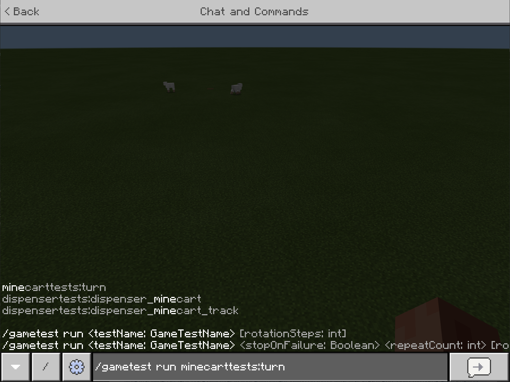
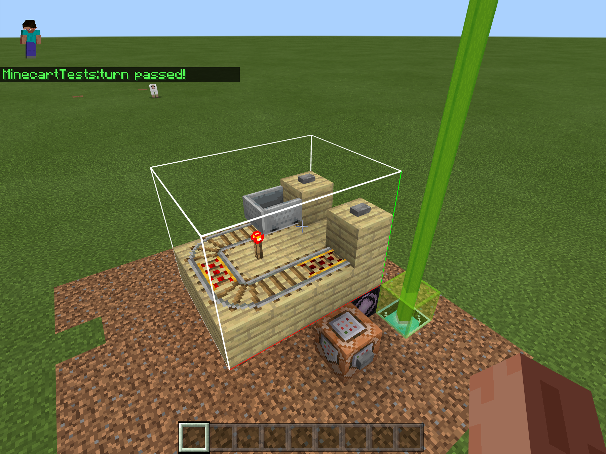

# Introduction to the GameTest Framework

GameTest Framework is a new toolset available to creators to build and test any new content created by you.  Within the world of Minecraft, you can express infinite forms of gameplay and variability in your content. With all these creative possibilities, sometimes a Creator may need additional tools to help validate that your experiences are running just as you expect it, and assist you as you customize aspects of the broader Minecraft environment.

What happens if you change the behavior of Villagers? or introduce a new Mob? Small changes can have unexpectedly big impacts that can be really hard to anticipate. With the GameTest Framework - a system for establishing sets of tests - you can track and repeat to ensure everything works the way you intend.  

With these tests, you can express and document your expectations for how things should work - both for your content and games, and for the Minecraft world. You'll be able to save time by using GameTests to take the place of repeatedly needing to manually play through conditions just to validate that all is working as expected.

Submitting and using GameTests can be a great way to establish and communicate the expected behavior you are looking for. As you build more complex worlds and adventures, use the GameTest Framework as a tool to validate facets of your content.

### Requirements

To get started, you'll want to begin with understanding how a Behavior Pack works within Minecraft.  To read more about creating behavior packs, see this topic:

> [!div class="checklist"]
> - [Introduction To Behavior Packs](https://review.docs.microsoft.com/en-us/minecraft/creator/testdocs/behaviorpack?branch=main) 

## What's a GameTest?

A GameTest is a miniature environment along with a set of starting conditions, such as a set of mobs or items.  After that environment plays out in the Minecraft world for a period of time, a GameTest has conditional code that evaluates whether expected conditions were met. If a test passes, you will receive confirmation that  everything is working as expected.  When a test fails, you can observe and diagnose why it may have failed.

Let's examine a potential use case for a GameTest. Let's say that we want to validate that a minecart can make its way around curves and over a complex track when Redstone triggers it. We can build a GameTest for this case by building out a track, placing a minecart at the start of the track, and then power the track with a block of Redstone.  We can then validate that the minecart reaches the end of its track within a reasonable time-frame. Minecraft includes a growing set of GameTests that test various basic situations in the Minecraft world. However, you can build your own GameTests to validate any changes you introduce.

## Running tests within game

To run tests within a game, you’ll want to create a new world or start with a copy of your existing adventure and experience.  

Within this GameTest world, you'll want to ensure that cheats are enabled and that the GameTest Framework experiment is turned on.  If you've created GameTest Framework tests within behavior packs, you'll want to add those Behavior Packs in your world.

>[!IMPORTANT]
>You’ll also likely want to specify some additional changes in your environment:
> - Selecting a Creative game mode
> - Selecting a Flat world
> - You will want to retain Normal difficulty (mobs work differently compared to Peaceful worlds)

Once the world is loaded, use the `/gametest` command to run tests. Minecraft includes a growing number of GameTests for various situations, testing out the behaviors of Mobs, Villagers, Redstone, and more.  You can see some of these tests as you work in the command line.

>[!IMPORTANT]
>Note that Minecraft tests place structures in your environment, sitting on top of what may already exist.  Don't run GameTest Framework in the middle of your beautiful creations if you haven't made a backup or copy first!

To run a specific test, use `/gametest run <classname>:<testName>`, like:

`/gametest run minecarttests:turn`

You will see the test run, and if the test completes successfully, you will see a "passed" completion message.

To run the default set of tests, use `/gametest runall`.

## What's Next?

Building sets of GameTests requires building out your GameTests via a behavior pack, and writing some simple JavaScript code.  When building out your own tests, you will likely want to start a new Test Behavior Pack that is just focused on adding additional GameTests.

>[!IMPORTANT]
>To build and run your own GameTests, you must use the latest Beta versions of Minecraft (version 1.16.230+). See [Minecraft Betas](https://aka.ms/mcbeta) for more information.

> [!div class="nextstepaction"]
>[Build your first GameTest](GameTestBuildYourFirstGameTest.md)
